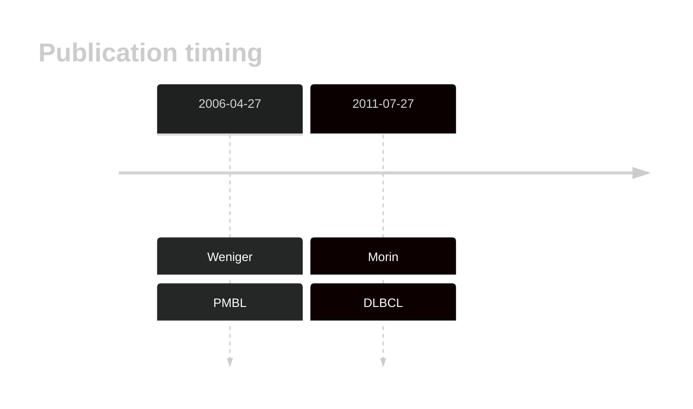

# SOCS1

## History

## Relevance tier by entity

|Entity|Tier|Description                           |
|:------:|:----:|--------------------------------------|
||1|high-confidence MZL gene|
||1|high-confidence PMBL/cHL/GZL gene|
| |1-a | aSHM target and high-confidence DLBCL gene            |
|    |1-a | aSHM target and high-confidence FL gene               |

## Mutation incidence in large patient cohorts (GAMBL reanalysis)

|Entity|source               |frequency (%)|
|:------:|:---------------------:|:-------------:|
|DLBCL |GAMBL genomes        |15.30        |
|DLBCL |Schmitz cohort       |12.77        |
|DLBCL |Reddy cohort         |10.41        |
|DLBCL |Chapuy cohort        | 4.70        |
|FL    |GAMBL genomes        | 9.70        |

## Mutation pattern and selective pressure estimates

|Entity|aSHM|Significant selection|dN/dS (missense)|dN/dS (nonsense)|
|:------:|:----:|:---------------------:|:----------------:|:----------------:|
|BL    |Yes |No                   | 4.476          |  0.000         |
|DLBCL |Yes |Yes                  | 5.023          | 17.509         |
|FL    |Yes |Yes                  |21.460          |123.344         |

## aSHM regions

|chr_name|hg19_start|hg19_end|region                                                                                         |regulatory_comment|
|:--------:|:----------:|:--------:|:-----------------------------------------------------------------------------------------------:|:------------------:|
|chr16   |11347512  |11350007|[intron-1](https://genome.ucsc.edu/s/rdmorin/GAMBL%20hg19?position=chr16%3A11347512%2D11350007)|enhancer          |

View coding variants in ProteinPaint [hg19](https://morinlab.github.io/LLMPP/GAMBL/SOCS1_protein.html)  or [hg38](https://morinlab.github.io/LLMPP/GAMBL/SOCS1_protein_hg38.html)

View all variants in GenomePaint [hg19](https://morinlab.github.io/LLMPP/GAMBL/SOCS1.html)  or [hg38](https://morinlab.github.io/LLMPP/GAMBL/SOCS1_hg38.html)

## SOCS1 Expression

<!-- ORIGIN: wenigerMutationsTumorSuppressor2006a -->
<!-- PMBL: wenigerMutationsTumorSuppressor2006a -->
<!-- DLBCL: morinFrequentMutationHistonemodifying2011 -->

## References
1.  Weniger MA, Melzner I, Menz CK, Wegener S, Bucur AJ, Dorsch K, Mattfeldt T, Barth TFE, Möller P. Mutations of the tumor suppressor gene SOCS-1 in classical Hodgkin lymphoma are frequent and associated with nuclear phospho-STAT5 accumulation. Oncogene. 2006 Apr 27;25(18):2679–2684. PMID: 16532038
2.  Morin RD, Mendez-Lago M, Mungall AJ, Goya R, Mungall KL, Corbett RD, Johnson NA, Severson TM, Chiu R, Field M, Jackman S, Krzywinski M, Scott DW, Trinh DL, Tamura-Wells J, Li S, Firme MR, Rogic S, Griffith M, Chan S, Yakovenko O, Meyer IM, Zhao EY, Smailus D, Moksa M, Chittaranjan S, Rimsza L, Brooks-Wilson A, Spinelli JJ, Ben-Neriah S, Meissner B, Woolcock B, Boyle M, McDonald H, Tam A, Zhao Y, Delaney A, Zeng T, Tse K, Butterfield Y, Birol I, Holt R, Schein J, Horsman DE, Moore R, Jones SJM, Connors JM, Hirst M, Gascoyne RD, Marra MA. Frequent mutation of histone-modifying genes in non-Hodgkin lymphoma. Nature. 2011 Jul 27;476(7360):298–303. PMCID: PMC3210554
