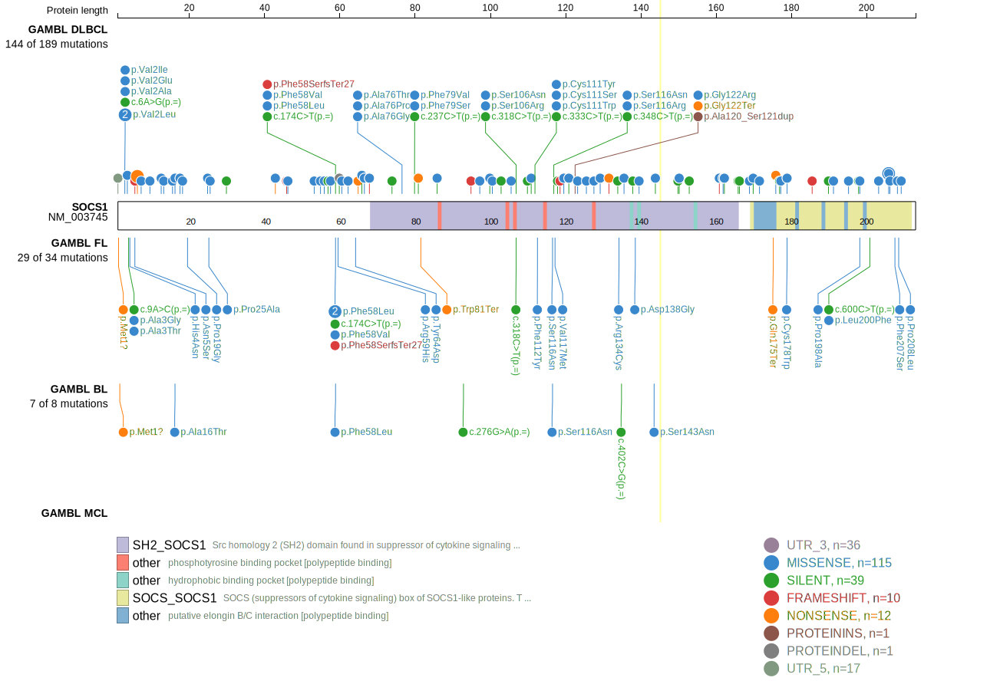
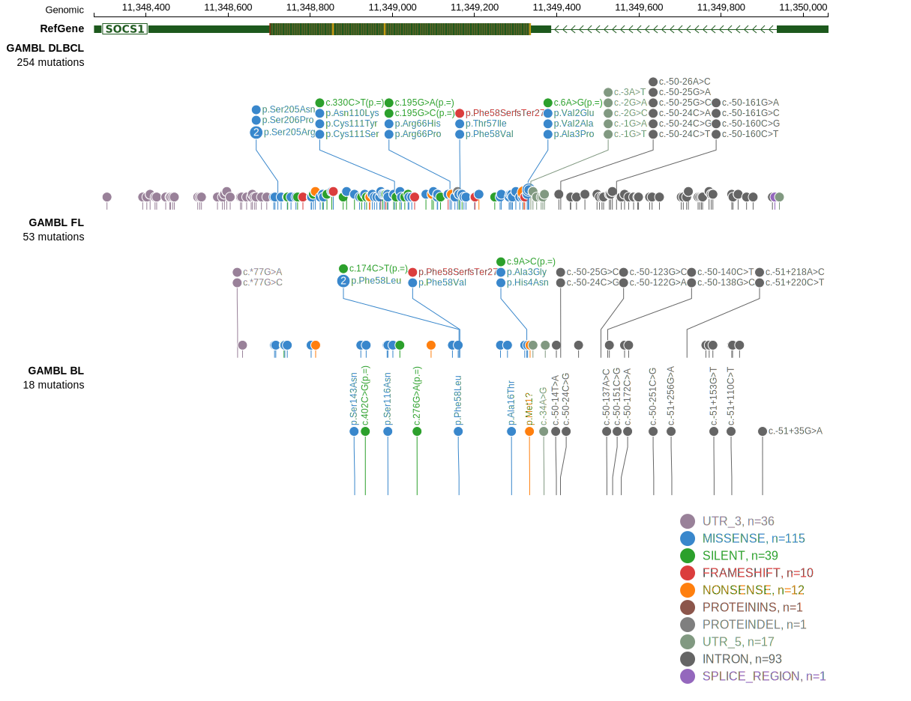

# [SOCS1]

## Mutation tier

|Entity|Tier|Description                           |
|:------:|:----:|--------------------------------------|
|BL    |2   |relevance in BL not firmly established|
|DLBCL |1   |high-confidence DLBCL gene            |
|FL    |1   |high-confidence FL gene               |
## Mutation incidence

|Entity|source               |frequency (%)|
|:------:|:---------------------:|:-------------:|
|BL    |GAMBL genomes+capture| 1.85        |
|BL    |Thomas cohort        | 1.70        |
|BL    |Panea cohort         | 3.00        |
|DLBCL |GAMBL genomes        |15.30        |
|DLBCL |Schmitz cohort       |12.80        |
|DLBCL |Reddy cohort         |10.40        |
|DLBCL |Chapuy cohort        | 4.70        |
|FL    |GAMBL genomes        | 9.70        |

## Mutation pattern

|Entity|aSHM|Significant selection|dN/dS (missense)|dN/dS (nonsense)|
|:------:|:----:|:---------------------:|:----------------:|:----------------:|
|BL    |Yes |No                   | 4.476          |  0.000         |
|DLBCL |Yes |Yes                  | 5.023          | 17.509         |
|FL    |Yes |Yes                  |21.460          |123.344         |

## aSHM regions

|chr_name|hg19_start|hg19_end|region                                                                                         |regulatory_comment|
|:--------:|:----------:|:--------:|:-----------------------------------------------------------------------------------------------:|:------------------:|
|chr16   |11347512  |11350007|[intron-1](https://genome.ucsc.edu/s/rdmorin/GAMBL%20hg19?position=chr16%3A11347512%2D11350007)|enhancer          |

 ## SOCS1 Hotspots

| Chromosome |Coordinate (hg19) | ref>alt | HGVSp | 
 | :---:| :---: | :--: | :---: |
| chr16 | 11349022 | T>C | D105G |
| chr16 | 11349019 | C>T | S106N |
| chr16 | 11349018 | G>C | S106R |
| chr16 | 11349006 | G>C | N110K |
| chr16 | 11349004 | C>T | C111Y |
| chr16 | 11349004 | C>G | C111S |
| chr16 | 11349003 | G>C | C111W |
| chr16 | 11349001 | A>T | F112Y |
| chr16 | 11348989 | C>T | S116N |
| chr16 | 11348988 | G>C | S116R |
| chr16 | 11348987 | C>T | V117M |
| chr16 | 11348981 | T>C | M119V |
| chr16 | 11348980 | A>T | M119K |
| chr16 | 11348977 | G>C | A120G |
| chr16 | 11348972 | C>T | G122R |
| chr16 | 11348972 | C>A | G122* |
| chr16 | 11348969 | G>A | P123S |
| chr16 | 11348962 | C>G | S125T |
| chr16 | 11348956 | C>T | R127H |
| chr16 | 11348951 | G>T | H129N |
| chr16 | 11348951 | G>A | H129Y |
| chr16 | 11348945 | G>A | Q131* |
| chr16 | 11348936 | G>A | R134C |
| chr16 | 11348933 | A>G | F135L |
| chr16 | 11348932 | A>C | F135C |

View coding variants in ProteinPaint [hg19](https://www.bcgsc.ca/downloads/morinlab/GAMBL/test/genes/SOCS1_protein.html)  or [hg38](https://www.bcgsc.ca/downloads/morinlab/GAMBL/test/genes/SOCS1_protein_hg38.html)

View all variants in GenomePaint [hg19](https://www.bcgsc.ca/downloads/morinlab/GAMBL/test/genes/SOCS1.html)  or [hg38](https://www.bcgsc.ca/downloads/morinlab/GAMBL/test/genes/SOCS1_hg38.html)

