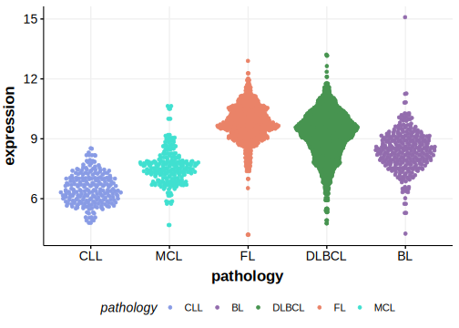

[[_TOC_]]

## Experimental Evidence

Driver mutations affecting this gene in FL/DLBCL have been experimentally demonstrated to cause a reduction or loss of function (LOF).[@melznerBiallelicMutationSOCS12005]

## Relevance tier by entity

[[include:table1_SOCS1.md]]

## Mutation incidence in large patient cohorts (GAMBL reanalysis)

### DLBCL
[[include:tables/DLBCL_SOCS1.md]]

### FL
[[include:tables/FL_SOCS1.md]]

## Mutation pattern and selective pressure estimates

[[include:tables/dnds_SOCS1.md]]

## aSHM regions

|chr_name|hg19_start|hg19_end|region                                                                                         |regulatory_comment|
|:--------:|:----------:|:--------:|:-----------------------------------------------------------------------------------------------:|:------------------:|
|chr16   |11347512  |11350007|[intron-1](https://genome.ucsc.edu/s/rdmorin/GAMBL%20hg19?position=chr16%3A11347512%2D11350007)|enhancer          |

[[include:browser_SOCS1.md]]

## Expression

<!-- ORIGIN: wenigerMutationsTumorSuppressor2006a -->
<!-- PMBL: wenigerMutationsTumorSuppressor2006a -->
<!-- DLBCL: morinFrequentMutationHistonemodifying2011 -->

[[include:mermaid_SOCS1.md]]

## References
