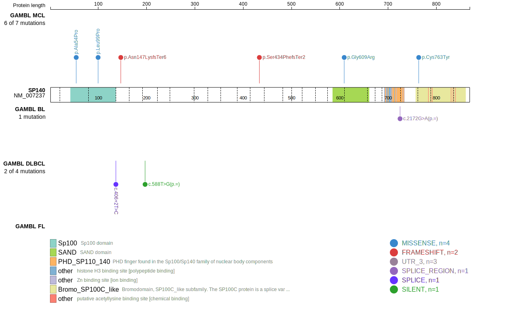
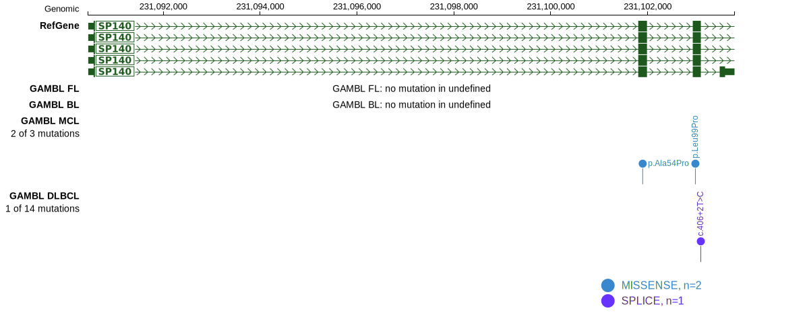

[[_TOC_]]

## Relevance tier by entity

|Entity|Tier|Description             |
|:------:|:----:|------------------------|
|   |1   |high-confidence MCL gene[@beaLandscapeSomaticMutations2013]|

## Mutation incidence in large patient cohorts (GAMBL reanalysis)

|Entity|source       |frequency (%)|
|:------:|:-------------:|:-------------:|
|MCL   |GAMBL genomes|5.21         |

## Mutation pattern and selective pressure estimates

|Entity|aSHM|Significant selection|dN/dS (missense)|dN/dS (nonsense)|
|:------:|:----:|:---------------------:|:----------------:|:----------------:|
|BL    |No  |No                   |0.000           | 0.000          |
|DLBCL |No  |No                   |0.803           |11.118          |
|FL    |No  |No                   |0.000           | 0.000          |

View coding variants in ProteinPaint [hg19](https://morinlab.github.io/LLMPP/GAMBL/SP140_protein.html)  or [hg38](https://morinlab.github.io/LLMPP/GAMBL/SP140_protein_hg38.html)

View all variants in GenomePaint [hg19](https://morinlab.github.io/LLMPP/GAMBL/SP140.html)  or [hg38](https://morinlab.github.io/LLMPP/GAMBL/SP140_hg38.html)

## SP140 Expression

<!-- ORIGIN: beaLandscapeSomaticMutations2013 -->
<!-- MCL: beaLandscapeSomaticMutations2013 -->

[[include:mermaid_SP140.md]]

## References

