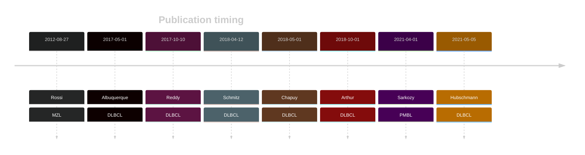

# SPEN

## History

## Relevance tier by entity

|Entity|Tier|Description               |
|:------:|:----:|--------------------------|
||1|high-confidence MZL gene[@rossiCodingGenomeSplenic2012c]|
||1|high-confidence PMBL/cHL/GZL gene[@sarkozyMutationalLandscapeGray2021a]|
| |1   |high-confidence DLBCL gene[@albuquerqueEnhancingKnowledgeDiscovery2017a; @reddyGeneticFunctionalDrivers2017; @schmitzGeneticsPathogenesisDiffuse2018a]|

## Mutation incidence in large patient cohorts (GAMBL reanalysis)

|Entity|source        |frequency (%)|
|:------:|:--------------:|:-------------:|
|DLBCL |GAMBL genomes | 4.78        |
|DLBCL |Schmitz cohort|10.00        |
|DLBCL |Reddy cohort  | 7.41        |
|DLBCL |Chapuy cohort | 9.83        |

## Mutation pattern and selective pressure estimates

|Entity|aSHM|Significant selection|dN/dS (missense)|dN/dS (nonsense)|
|:------:|:----:|:---------------------:|:----------------:|:----------------:|
|BL    |No  |No                   |1.456           | 0.000          |
|DLBCL |No  |No                   |0.900           |13.083          |
|FL    |No  |No                   |1.765           |25.228          |

## SPEN Hotspots

| Chromosome |Coordinate (hg19) | ref>alt | HGVSp | 
 | :---:| :---: | :--: | :---: |
| chr1 | 16256846 | C>T | R1371* |
| chr1 | 16261814 | C>T | R3027* |

View coding variants in ProteinPaint [hg19](https://morinlab.github.io/LLMPP/GAMBL/SPEN_protein.html)  or [hg38](https://morinlab.github.io/LLMPP/GAMBL/SPEN_protein_hg38.html)

View all variants in GenomePaint [hg19](https://morinlab.github.io/LLMPP/GAMBL/SPEN.html)  or [hg38](https://morinlab.github.io/LLMPP/GAMBL/SPEN_hg38.html)

## SPEN Expression

<!-- ORIGIN: rossiCodingGenomeSplenic2012c -->
<!-- DLBCL: rossiCodingGenomeSplenic2012c -->
<!-- MZL: rossiCodingGenomeSplenic2012c -->
<!-- PMBL: sarkozyMutationalLandscapeGray2021a -->

## References

