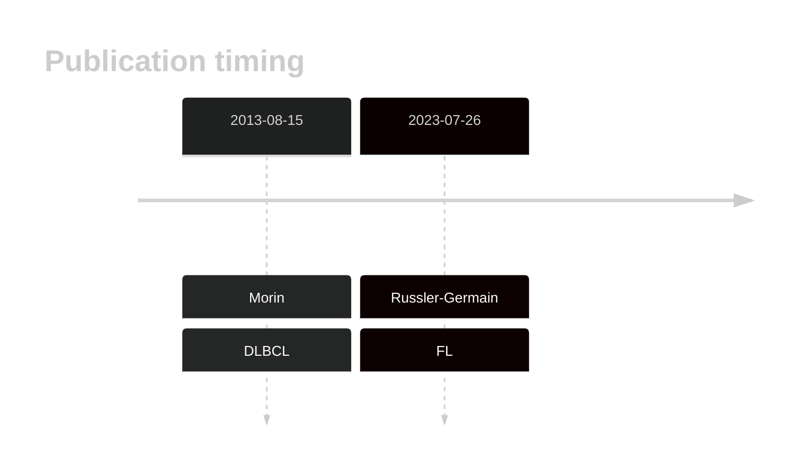

# SRRM2
## History

## Relevance tier by entity

|Entity|Tier|Description                              |
|:------:|:----:|-----------------------------------------|
| |2   |relevance in DLBCL not firmly established|
|    |2   |relevance in FL not firmly established   |

## Mutation incidence in large patient cohorts (GAMBL reanalysis)

|Entity|source        |frequency (%)|
|:------:|:--------------:|:-------------:|
|DLBCL |GAMBL genomes |3.06         |
|DLBCL |Schmitz cohort|6.38         |
|DLBCL |Reddy cohort  |6.61         |
|DLBCL |Chapuy cohort |6.84         |
|FL    |GAMBL genomes |1.39         |

## Mutation pattern and selective pressure estimates

|Entity|aSHM|Significant selection|dN/dS (missense)|dN/dS (nonsense)|
|:------:|:----:|:---------------------:|:----------------:|:----------------:|
|BL    |No  |No                   |1.604           |1.723           |
|DLBCL |No  |No                   |1.835           |0.000           |
|FL    |No  |No                   |1.461           |0.000           |

View coding variants in ProteinPaint [hg19](https://morinlab.github.io/LLMPP/GAMBL/SRRM2_protein.html)  or [hg38](https://morinlab.github.io/LLMPP/GAMBL/SRRM2_protein_hg38.html)

View all variants in GenomePaint [hg19](https://morinlab.github.io/LLMPP/GAMBL/SRRM2.html)  or [hg38](https://morinlab.github.io/LLMPP/GAMBL/SRRM2_hg38.html)

## SRRM2 Expression

<!-- ORIGIN: morinMutationalStructuralAnalysis2013 -->
<!-- DLBCL: morinMutationalStructuralAnalysis2013 -->
<!-- FL: russler-germainMutationsAssociatedProgression2023b -->
## References
1.  Morin RD, Mungall K, Pleasance E, Mungall AJ, Goya R, Huff RD, Scott DW, Ding J, Roth A, Chiu R, Corbett RD, Chan FC, Mendez-Lago M, Trinh DL, Bolger-Munro M, Taylor G, Hadj Khodabakhshi A, Ben-Neriah S, Pon J, Meissner B, Woolcock B, Farnoud N, Rogic S, Lim EL, Johnson NA, Shah S, Jones S, Steidl C, Holt R, Birol I, Moore R, Connors JM, Gascoyne RD, Marra MA. Mutational and structural analysis of diffuse large B-cell lymphoma using whole-genome sequencing. Blood. 2013 Aug 15;122(7):1256–1265. PMCID: PMC3744992
2.  Russler-Germain DA, Krysiak K, Ramirez CA, Mosior M, Watkins MP, Gomez F, Skidmore ZL, Trani L, Gao F, Geyer S, Cashen A, Mehta-Shah N, Kahl B, Bartlett N, Alderuccio J, Lossos I, Ondrejka S, Hsi E, Martin P, Leonard J, Griffith M, Griffith O, Fehniger T. Mutations associated with progression in follicular lymphoma predict inferior outcomes at diagnosis: Alliance A151303. Blood Advances. 2023;7:5524–5539. 
