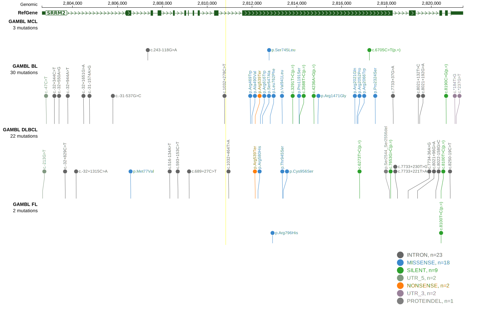

[[_TOC_]]

## Relevance tier by entity

|Entity|Tier|Description                              |
|:------:|:----:|-----------------------------------------|
| |2   |relevance in DLBCL not firmly established[@morinMutationalStructuralAnalysis2013]|
|    |2   |relevance in FL not firmly established   [@russler-germainMutationsAssociatedProgression2023]|

## Mutation incidence in large patient cohorts (GAMBL reanalysis)

|Entity|source        |frequency (%)|
|:------:|:--------------:|:-------------:|
|DLBCL |GAMBL genomes |3.06         |
|DLBCL |Schmitz cohort|6.38         |
|DLBCL |Reddy cohort  |6.61         |
|DLBCL |Chapuy cohort |6.84         |
|FL    |GAMBL genomes |1.39         |

## Mutation pattern and selective pressure estimates

|Entity|aSHM|Significant selection|dN/dS (missense)|dN/dS (nonsense)|
|:------:|:----:|:---------------------:|:----------------:|:----------------:|
|BL    |No  |No                   |1.604           |1.723           |
|DLBCL |No  |No                   |1.835           |0.000           |
|FL    |No  |No                   |1.461           |0.000           |

View coding variants in ProteinPaint [hg19](https://morinlab.github.io/LLMPP/GAMBL/SRRM2_protein.html)  or [hg38](https://morinlab.github.io/LLMPP/GAMBL/SRRM2_protein_hg38.html)

View all variants in GenomePaint [hg19](https://morinlab.github.io/LLMPP/GAMBL/SRRM2.html)  or [hg38](https://morinlab.github.io/LLMPP/GAMBL/SRRM2_hg38.html)

## SRRM2 Expression

<!-- ORIGIN: morinMutationalStructuralAnalysis2013 -->
<!-- DLBCL: morinMutationalStructuralAnalysis2013 -->
<!-- FL: russler-germainMutationsAssociatedProgression2023b -->

## All Mutations

[RG043](https://www.bcgsc.ca/downloads/morinlab/GAMBL/Morin_2013/RG043.html)

[[include:mermaid_SRRM2.md]]

## References

