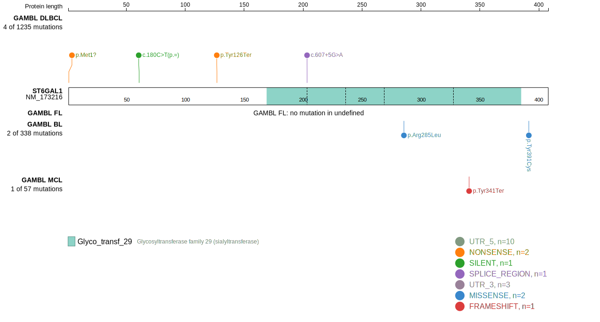
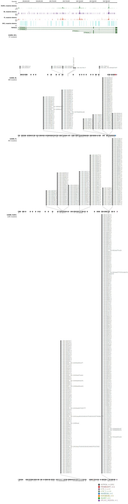

# [ST6GAL1]

## Mutation tier

|Entity|Tier|Description                              |
|:------:|:----:|-----------------------------------------|
|DLBCL |2-a | aSHM target; Although recurrent, the relevance of mutations in DLBCL is tenuous |
## Mutation incidence

|Entity|source        |frequency (%)|
|:------:|:--------------:|:-------------:|
|DLBCL |GAMBL genomes |1.15         |
|DLBCL |Schmitz cohort|1.49         |
|DLBCL |Reddy cohort  |0.90         |
|DLBCL |Chapuy cohort |0.85         |

## Mutation pattern

|Entity|aSHM|Significant selection|dN/dS (missense)|dN/dS (nonsense)|
|:------:|:----:|:---------------------:|:----------------:|:----------------:|
|BL    |Yes |No                   |4.123           | 0.000          |
|DLBCL |Yes |Yes                  |2.511           |33.311          |
|FL    |Yes |No                   |0.000           | 0.000          |

## aSHM regions

|chr_name|hg19_start|hg19_end |region                                                                                          |regulatory_comment|
|:--------:|:----------:|:---------:|:------------------------------------------------------------------------------------------------:|:------------------:|
|chr3    |186647943 |186650177|[TSS-2](https://genome.ucsc.edu/s/rdmorin/GAMBL%20hg19?position=chr3%3A186647943%2D186650177)   |NA                |
|chr3    |186739628 |186740875|[TSS-1](https://genome.ucsc.edu/s/rdmorin/GAMBL%20hg19?position=chr3%3A186739628%2D186740875)   |active_promoter   |
|chr3    |186709494 |186721749|[intron-2](https://genome.ucsc.edu/s/rdmorin/GAMBL%20hg19?position=chr3%3A186709494%2D186721749)|NA                |
|chr3    |186782522 |186784438|[intron-1](https://genome.ucsc.edu/s/rdmorin/GAMBL%20hg19?position=chr3%3A186782522%2D186784438)|strong_enhancer   |

View coding variants in ProteinPaint [hg19](https://www.bcgsc.ca/downloads/morinlab/GAMBL/test/genes/ST6GAL1_protein.html)  or [hg38](https://www.bcgsc.ca/downloads/morinlab/GAMBL/test/genes/ST6GAL1_protein_hg38.html)

View all variants in GenomePaint [hg19](https://www.bcgsc.ca/downloads/morinlab/GAMBL/test/genes/ST6GAL1.html)  or [hg38](https://www.bcgsc.ca/downloads/morinlab/GAMBL/test/genes/ST6GAL1_hg38.html)

