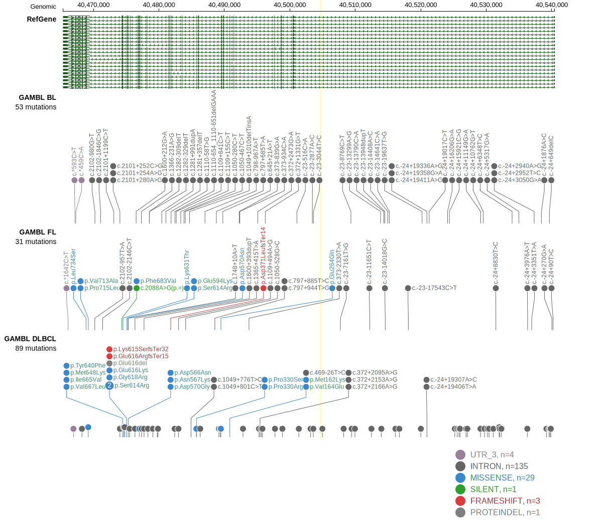

# STAT3

## Relevance tier by entity

|Entity|Tier|Description                           |
|:------:|:----:|--------------------------------------|
|BL    |2   |relevance in BL not firmly established|
|DLBCL |1   |high-confidence DLBCL gene            |

## Mutation incidence in large patient cohorts (GAMBL reanalysis)

|Entity|source               |frequency (%)|
|:------:|:---------------------:|:-------------:|
|BL    |GAMBL genomes+capture|0.92         |
|BL    |Thomas cohort        |0.00         |
|BL    |Panea cohort         |1.00         |
|DLBCL |GAMBL genomes        |7.07         |
|DLBCL |Schmitz cohort       |9.36         |
|DLBCL |Reddy cohort         |3.60         |
|DLBCL |Chapuy cohort        |7.26         |

## Mutation pattern and selective pressure estimates

|Entity|aSHM|Significant selection|dN/dS (missense)|dN/dS (nonsense)|
|:------:|:----:|:---------------------:|:----------------:|:----------------:|
|BL    |No  |No                   | 0.000          | 0.000          |
|DLBCL |No  |Yes                  |27.471          |12.427          |
|FL    |No  |No                   |34.737          | 0.000          |

> [!NOTE]
> First described in DLBCL in 2014 by [Ohgami RS](https://pubmed.ncbi.nlm.nih.gov/24837465)

 ## STAT3 Hotspots

| Chromosome |Coordinate (hg19) | ref>alt | HGVSp | 
 | :---:| :---: | :--: | :---: |
| chr17 | 40475330 | C>T | D566N |
| chr17 | 40475325 | A>T | N567K |
| chr17 | 40475318 | C>T | D570N |
| chr17 | 40475317 | T>C | D570G |

View coding variants in ProteinPaint [hg19](https://morinlab.github.io/LLMPP/GAMBL/STAT3_protein.html)  or [hg38](https://morinlab.github.io/LLMPP/GAMBL/STAT3_protein_hg38.html)

View all variants in GenomePaint [hg19](https://morinlab.github.io/LLMPP/GAMBL/STAT3.html)  or [hg38](https://morinlab.github.io/LLMPP/GAMBL/STAT3_hg38.html)

