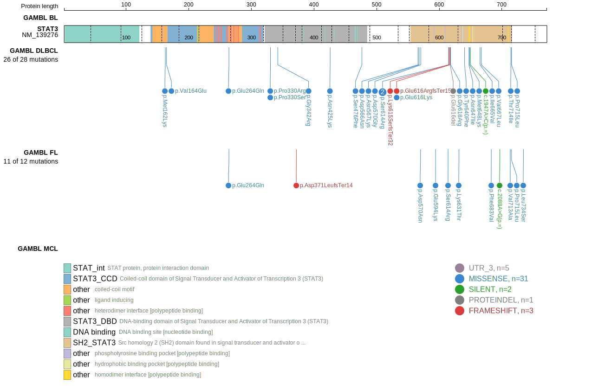

# [STAT3]

## Mutation tier

|Entity|Tier|Description                           |
|:------:|:----:|--------------------------------------|
|BL    |2   |relevance in BL not firmly established|
|DLBCL |1   |high-confidence DLBCL gene            |
## Mutation incidence

|Entity|source               |frequency (%)|
|:------:|:---------------------:|:-------------:|
|BL    |GAMBL genomes+capture|0.92         |
|BL    |Thomas cohort        |0.00         |
|BL    |Panea cohort         |1.00         |
|DLBCL |GAMBL genomes        |7.07         |
|DLBCL |Schmitz cohort       |9.40         |
|DLBCL |Reddy cohort         |3.60         |
|DLBCL |Chapuy cohort        |7.30         |

## Mutation pattern

|Entity|aSHM|Significant selection|dN/dS (missense)|dN/dS (nonsense)|
|:------:|:----:|:---------------------:|:----------------:|:----------------:|
|BL    |No  |No                   | 0.000          | 0.000          |
|DLBCL |No  |Yes                  |27.471          |12.427          |
|FL    |No  |No                   |34.737          | 0.000          |

View coding variants in ProteinPaint [hg19](https://www.bcgsc.ca/downloads/morinlab/GAMBL/test/genes/STAT3_protein.html)  or [hg38](https://www.bcgsc.ca/downloads/morinlab/GAMBL/test/genes/STAT3_protein_hg38.html)

View all variants in GenomePaint [hg19](https://www.bcgsc.ca/downloads/morinlab/GAMBL/test/genes/STAT3.html)  or [hg38](https://www.bcgsc.ca/downloads/morinlab/GAMBL/test/genes/STAT3_hg38.html)

