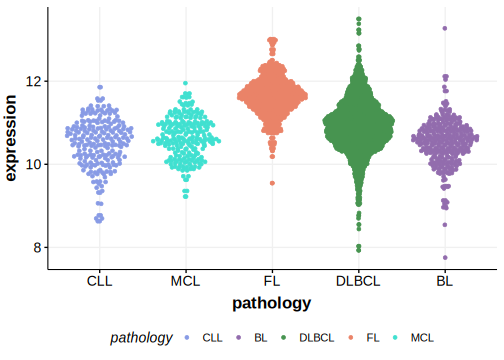

[[_TOC_]]

## Overview

Mutations in this gene were first described in DLBCL in 2013[@zhangGeneticHeterogeneityDiffuse2013] and by the same group in a subsequent study.[@reddyGeneticFunctionalDrivers2017] It remains in Tier 2 because other exome and genome-wide studies of DLBCL did not reproduce this observation. 

## Relevance tier by entity

[[include:table1_STAT5B.md]]

## Mutation incidence in large patient cohorts (GAMBL reanalysis)

|Entity|source        |frequency (%)|
|:------:|:--------------:|:-------------:|
|DLBCL |GAMBL genomes |0.57         |
|DLBCL |Schmitz cohort|0.43         |
|DLBCL |Reddy cohort  |1.60         |
|DLBCL |Chapuy cohort |0.43         |

## Mutation pattern and selective pressure estimates

[[include:dnds_STAT5B.md]]

[[include:browser_STAT5B.md]]

## Expression

<!-- ORIGIN: zhangGeneticHeterogeneityDiffuse2013 -->
<!-- PMBL: tiacciPervasiveMutationsJAKSTAT2018b -->
<!-- DLBCL: zhangGeneticHeterogeneityDiffuse2013 -->

[[include:mermaid_STAT5B.md]]

## References
