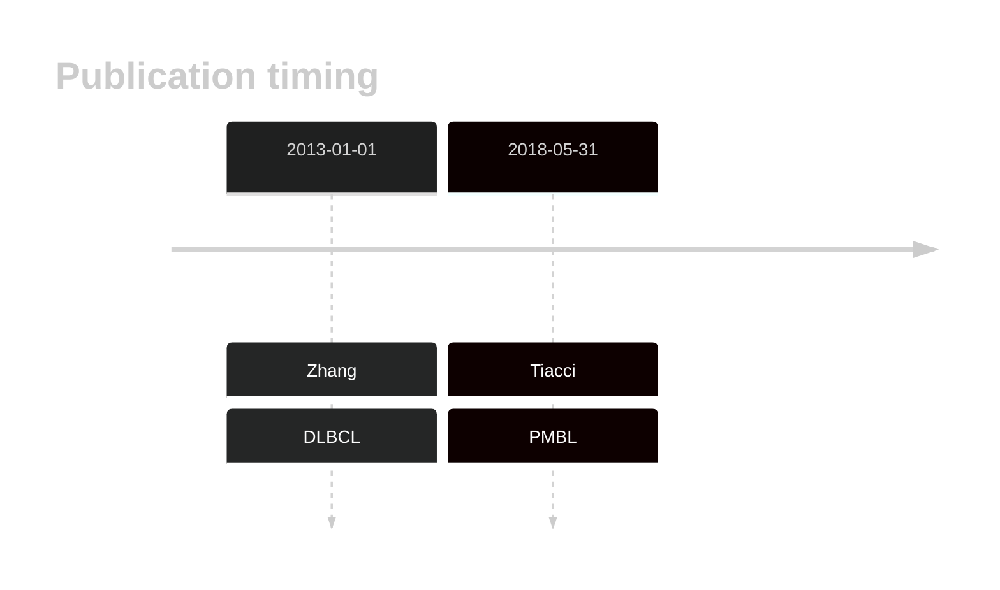

# STAT5B

## History

## Relevance tier by entity

|Entity|Tier|Description                              |
|:------:|:----:|-----------------------------------------|
||2|relevance in PMBL/cHL/GZL not firmly established[@tiacciPervasiveMutationsJAKSTAT2018b]|
| |2   |relevance in DLBCL not firmly established[@zhangGeneticHeterogeneityDiffuse2013]|

## Mutation incidence in large patient cohorts (GAMBL reanalysis)

|Entity|source        |frequency (%)|
|:------:|:--------------:|:-------------:|
|DLBCL |GAMBL genomes |0.57         |
|DLBCL |Schmitz cohort|0.43         |
|DLBCL |Reddy cohort  |1.60         |
|DLBCL |Chapuy cohort |0.43         |

## Mutation pattern and selective pressure estimates

|Entity|aSHM|Significant selection|dN/dS (missense)|dN/dS (nonsense)|
|:------:|:----:|:---------------------:|:----------------:|:----------------:|
|BL    |No  |No                   |1.137           |0               |
|DLBCL |No  |No                   |1.568           |0               |
|FL    |No  |No                   |0.000           |0               |

View coding variants in ProteinPaint [hg19](https://morinlab.github.io/LLMPP/GAMBL/STAT5B_protein.html)  or [hg38](https://morinlab.github.io/LLMPP/GAMBL/STAT5B_protein_hg38.html)

View all variants in GenomePaint [hg19](https://morinlab.github.io/LLMPP/GAMBL/STAT5B.html)  or [hg38](https://morinlab.github.io/LLMPP/GAMBL/STAT5B_hg38.html)

## STAT5B Expression

<!-- ORIGIN: zhangGeneticHeterogeneityDiffuse2013 -->
<!-- PMBL: tiacciPervasiveMutationsJAKSTAT2018b -->
<!-- DLBCL: zhangGeneticHeterogeneityDiffuse2013 -->

## References
