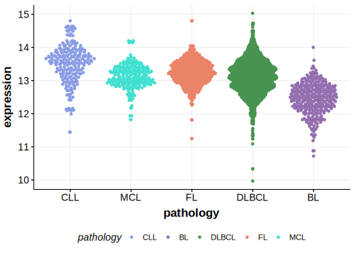

# STAT6

[[_TOC_]]

## Overview
The STAT6 gene, which encodes a transcription factor involved in the JAK-STAT signaling pathway, plays a significant role in the pathogenesis of various lymphomas, including diffuse large B-cell lymphoma (DLBCL). Below is a summary of the common mutations in the STAT6 gene identified in DLBCL. Mutations in the DNA binding domain of STAT6 are common in PMBCL and more rare in DLBCL. 

## Experimental Evidence

Driver mutations affecting this gene in DLBCL/FL have been experimentally demonstrated to cause a gain of function (GOF).[@mentzPARP14NovelTarget2022]

## Relevance tier by entity

[[include:tables/table1_STAT6.md]]

## Mutation incidence in large patient cohorts (GAMBL reanalysis)

### DLBCL
[[include:tables/DLBCL_STAT6.md]]

### FL
[[include:tables/FL_STAT6.md]]

## Mutation pattern and selective pressure estimates

[[include:tables/dnds_STAT6.md]]

## STAT6 Hotspots

Recurrent mutations at the D419 amino acid residue are a common feature in DLBCL, specifically affecting the germinal center B (GCB) cell subtype. These mutations lead to the activation of the JAK/STAT signaling pathway, contributing to lymphomagenesis [@morinGeneticLandscapesRelapsed2016].

| Chromosome |Coordinate (hg19) | ref>alt | HGVSp | 
 | :---:| :---: | :--: | :---: |
| chr12 | 57496671 | C>G | G416R |
| chr12 | 57496666 | G>T | N417K |
| chr12 | 57496662 | C>T | D419N |
| chr12 | 57496662 | C>G | D419H |
| chr12 | 57496662 | C>A | D419Y |
| chr12 | 57496661 | T>G | D419A |
| chr12 | 57496661 | T>C | D419G |
| chr12 | 57496661 | T>A | D419V |
| chr12 | 57496658 | T>G | N420T |
| chr12 | 57496658 | T>C | N420S |
| chr12 | 57496656 | T>C | N421D |
| chr12 | 57496654 | A>C | N421K |

[[include:browser_STAT6.md]]

## Expression

<!-- ORIGIN: yildizActivatingSTAT6Mutations2015c -->
<!-- PMBL: ritzRecurrentMutationsSTAT62009a -->
<!-- FL: yildizActivatingSTAT6Mutations2015c -->
<!-- DLBCL: yildizActivatingSTAT6Mutations2015c -->

[[include:tables/mermaid_STAT6.md]]

## References

