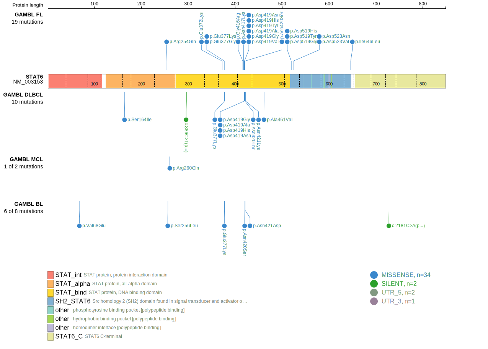
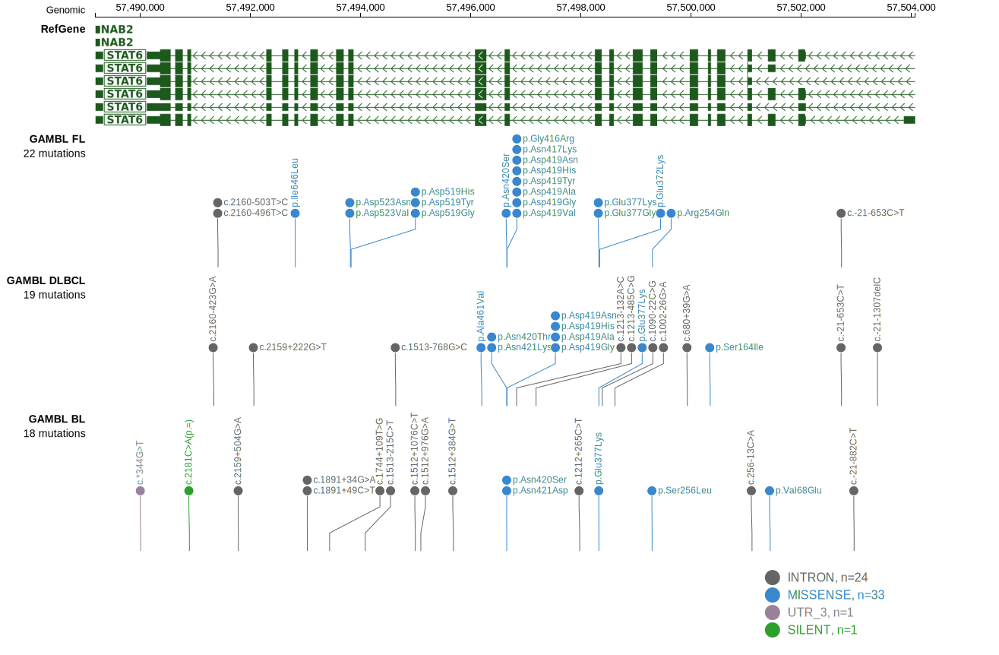

# [STAT6]

## Mutation tier

|Entity|Tier|Description                           |
|:------:|:----:|--------------------------------------|
|BL    |2   |relevance in BL not firmly established|
|DLBCL |1   |high-confidence DLBCL gene            |
|FL    |1   |high-confidence FL gene               |
## Mutation incidence

|Entity|source               |frequency (%)|
|:------:|:---------------------:|:-------------:|
|BL    |GAMBL genomes+capture| 1.62        |
|BL    |Thomas cohort        | 1.70        |
|BL    |Panea cohort         | 2.00        |
|DLBCL |GAMBL genomes        | 5.74        |
|DLBCL |Schmitz cohort       | 2.60        |
|DLBCL |Reddy cohort         | 3.80        |
|DLBCL |Chapuy cohort        | 4.70        |
|FL    |GAMBL genomes        |15.94        |

## Mutation pattern

|Entity|aSHM|Significant selection|dN/dS (missense)|dN/dS (nonsense)|
|:------:|:----:|:---------------------:|:----------------:|:----------------:|
|BL    |No  |No                   |  3.301         |0               |
|DLBCL |No  |No                   | 11.582         |0               |
|FL    |No  |Yes                  |116.612         |0               |

 ## STAT6 Hotspots

| Chromosome |Coordinate (hg19) | ref>alt | HGVSp | 
 | :---:| :---: | :--: | :---: |
| chr12 | 57496671 | C>G | G416R |
| chr12 | 57496666 | G>T | N417K |
| chr12 | 57496662 | C>T | D419N |
| chr12 | 57496662 | C>G | D419H |
| chr12 | 57496662 | C>A | D419Y |
| chr12 | 57496661 | T>G | D419A |
| chr12 | 57496661 | T>C | D419G |
| chr12 | 57496661 | T>A | D419V |
| chr12 | 57496658 | T>G | N420T |
| chr12 | 57496658 | T>C | N420S |
| chr12 | 57496656 | T>C | N421D |
| chr12 | 57496654 | A>C | N421K |

View coding variants in ProteinPaint [hg19](https://www.bcgsc.ca/downloads/morinlab/GAMBL/test/genes/STAT6_protein.html)  or [hg38](https://www.bcgsc.ca/downloads/morinlab/GAMBL/test/genes/STAT6_protein_hg38.html)

View all variants in GenomePaint [hg19](https://www.bcgsc.ca/downloads/morinlab/GAMBL/test/genes/STAT6.html)  or [hg38](https://www.bcgsc.ca/downloads/morinlab/GAMBL/test/genes/STAT6_hg38.html)

