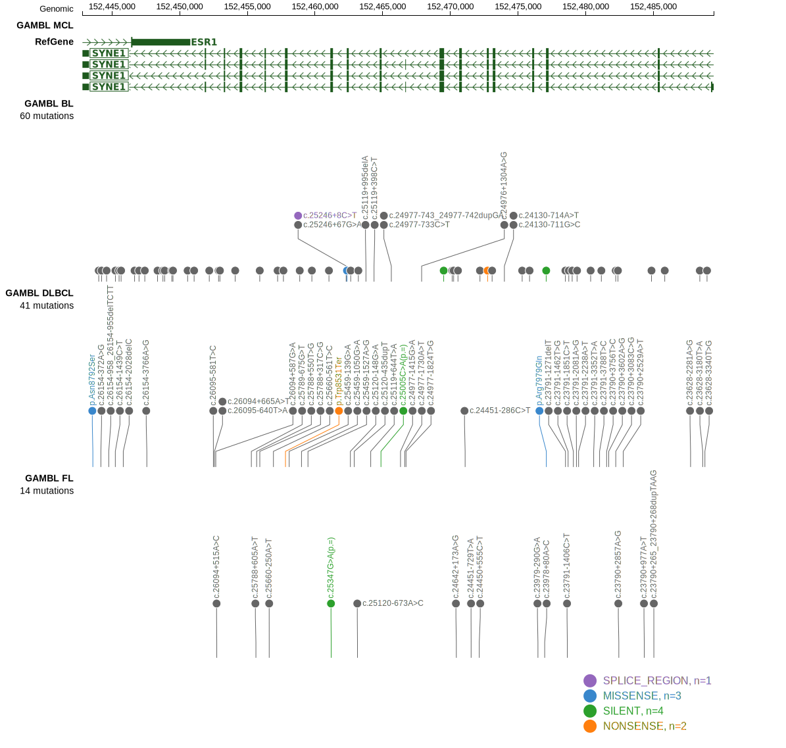

# [SYNE1]

## Mutation tier

|Entity|Tier|Description             |
|:------:|:----:|------------------------|
|MCL   |1   |high-confidence MCL gene|
## Mutation incidence

|Entity|source       |frequency (%)|
|:------:|:-------------:|:-------------:|
|MCL   |GAMBL genomes|4.74         |

## Mutation pattern

|Entity|aSHM|Significant selection|dN/dS (missense)|dN/dS (nonsense)|
|:------:|:----:|:---------------------:|:----------------:|:----------------:|
|BL    |No  |No                   |0.000           |0.000           |
|DLBCL |No  |No                   |0.927           |2.598           |
|FL    |No  |No                   |0.000           |0.000           |

> [!NOTE]
> First described in MCL in 2020 by [Nadeu F](https://pubmed.ncbi.nlm.nih.gov/32584970)

View coding variants in ProteinPaint [hg19](https://www.bcgsc.ca/downloads/morinlab/GAMBL/test/genes/SYNE1_protein.html)  or [hg38](https://www.bcgsc.ca/downloads/morinlab/GAMBL/test/genes/SYNE1_protein_hg38.html)

View all variants in GenomePaint [hg19](https://www.bcgsc.ca/downloads/morinlab/GAMBL/test/genes/SYNE1.html)  or [hg38](https://www.bcgsc.ca/downloads/morinlab/GAMBL/test/genes/SYNE1_hg38.html)

