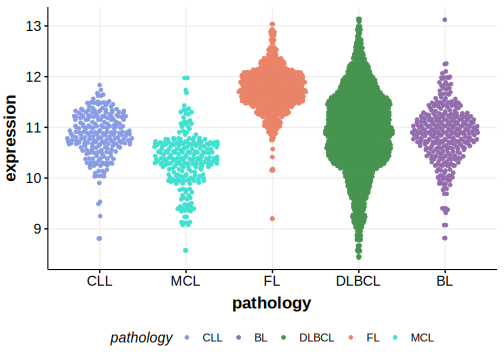

[[_TOC_]]

## Relevance tier by entity

[[include:tables/table1_SYNE1.md]]

## Mutation incidence in large patient cohorts (GAMBL reanalysis)

### MCL
[[include:tables/MCL_SYNE1.md]]

<!---
## Mutation pattern and selective pressure estimates
-->

[[include:browser_SYNE1.md]]

## Expression

<!-- ORIGIN: nadeuGenomicEpigenomicInsights2020a -->
<!-- MCL: nadeuGenomicEpigenomicInsights2020b -->

[[include:tables/mermaid_SYNE1.md]]

## References

