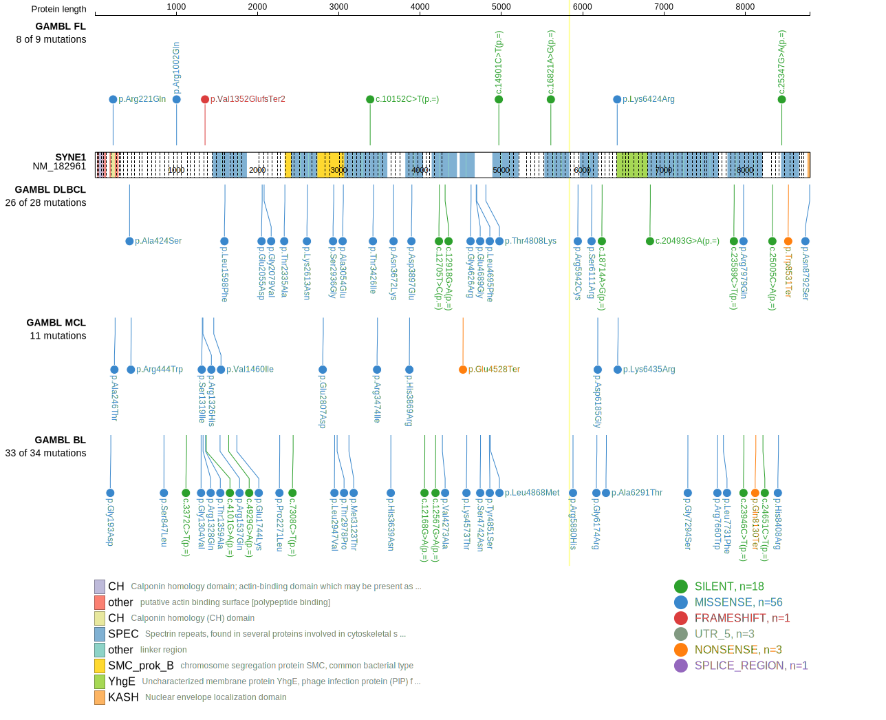

# SYNE1

## History

## Relevance tier by entity

|Entity|Tier|Description             |
|:------:|:----:|------------------------|
|   |1   |high-confidence MCL gene[@nadeuGenomicEpigenomicInsights2020b]|

## Mutation incidence in large patient cohorts (GAMBL reanalysis)

|Entity|source       |frequency (%)|
|:------:|:-------------:|:-------------:|
|MCL   |GAMBL genomes|4.74         |

## Mutation pattern and selective pressure estimates

|Entity|aSHM|Significant selection|dN/dS (missense)|dN/dS (nonsense)|
|:------:|:----:|:---------------------:|:----------------:|:----------------:|
|BL    |No  |No                   |0.000           |0.000           |
|DLBCL |No  |No                   |0.927           |2.598           |
|FL    |No  |No                   |0.000           |0.000           |

View coding variants in ProteinPaint [hg19](https://morinlab.github.io/LLMPP/GAMBL/SYNE1_protein.html)  or [hg38](https://morinlab.github.io/LLMPP/GAMBL/SYNE1_protein_hg38.html)

View all variants in GenomePaint [hg19](https://morinlab.github.io/LLMPP/GAMBL/SYNE1.html)  or [hg38](https://morinlab.github.io/LLMPP/GAMBL/SYNE1_hg38.html)

## SYNE1 Expression

<!-- ORIGIN: nadeuGenomicEpigenomicInsights2020a -->
<!-- MCL: nadeuGenomicEpigenomicInsights2020b -->

## References

