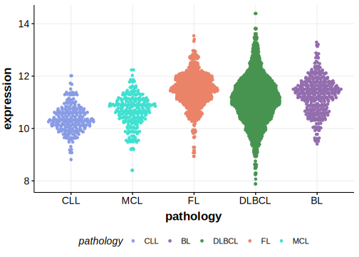

[[_TOC_]]

## Relevance tier by entity

|Entity|Tier|Description                              |
|:------:|:----:|-----------------------------------------|
| |2   |relevance in DLBCL not firmly established[@morinMutationalStructuralAnalysis2013]|

## Mutation incidence in large patient cohorts (GAMBL reanalysis)

|Entity|source        |frequency (%)|
|:------:|:--------------:|:-------------:|
|DLBCL |GAMBL genomes |0.96         |
|DLBCL |Schmitz cohort|1.28         |
|DLBCL |Reddy cohort  |0.40         |
|DLBCL |Chapuy cohort |0.85         |

## Mutation pattern and selective pressure estimates

[[include:dnds_SYPL1.md]]

[[include:browser_SYPL1.md]]

## Expression

<!-- ORIGIN: morinMutationalStructuralAnalysis2013 -->
<!-- DLBCL: morinMutationalStructuralAnalysis2013 -->

## All Mutations

[RG054](https://www.bcgsc.ca/downloads/morinlab/GAMBL/Morin_2013/RG054.html)
[RG082](https://www.bcgsc.ca/downloads/morinlab/GAMBL/Morin_2013/RG082.html)

[[include:mermaid_SYPL1.md]]

## References

