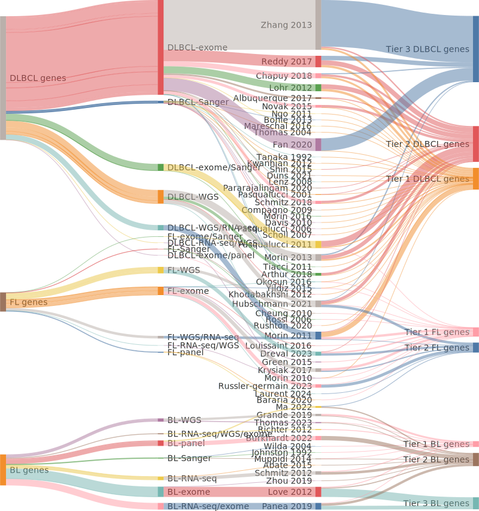
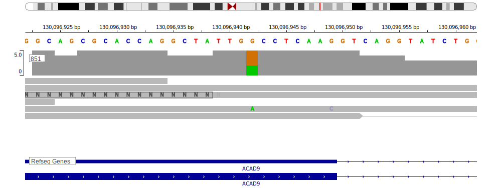
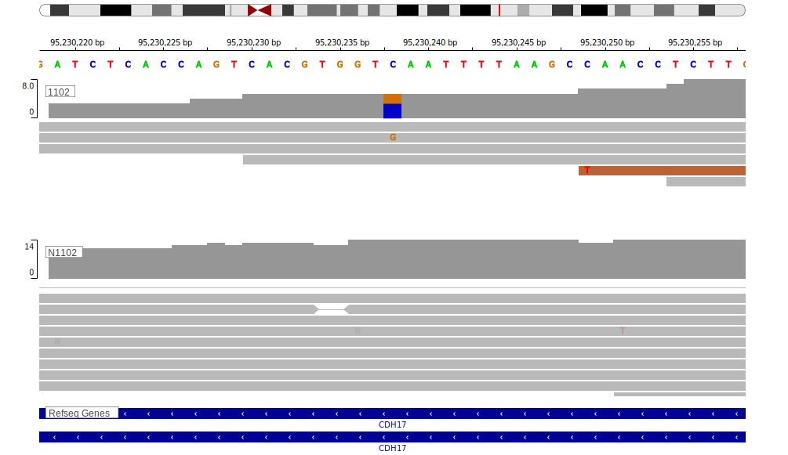
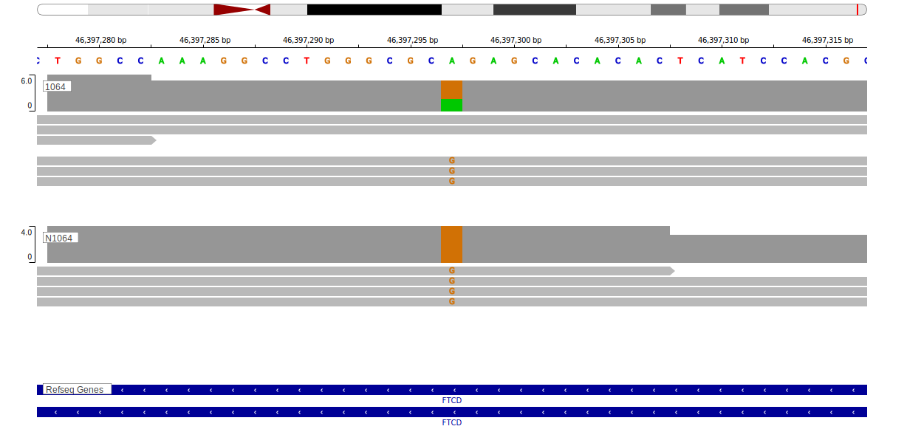
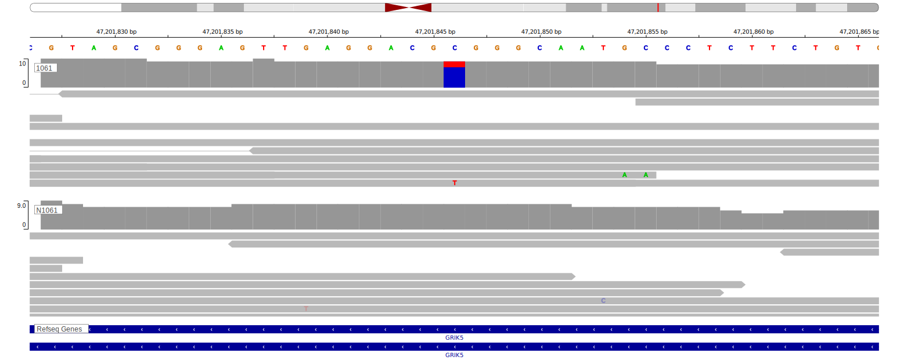
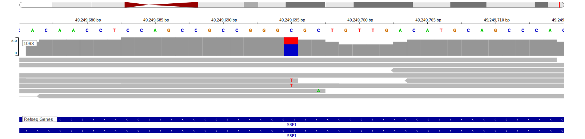
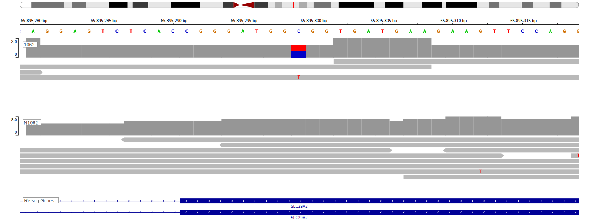
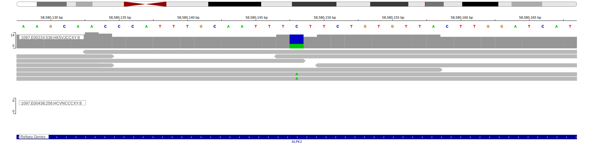
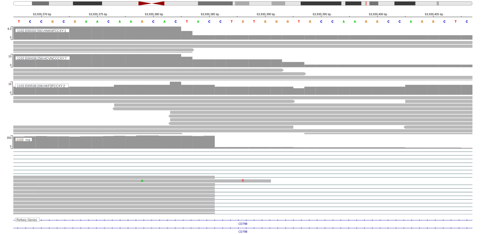

# Supplemental Methods and Results

## Sources of B-cell lymphoma genes

Any study that described at least one gene as recurrently mutated in DLBCL, FL or BL was eligible to contribute to the gene lists. The current lists relied on a total of 37 studies for DLBCL,[@albuquerqueEnhancingKnowledgeDiscovery2017; @arthurGenomewideDiscoverySomatic2018; @bohleRoleEarlyBcell2013; @chapuyMolecularSubtypesDiffuse2018; @compagnoMutationsMultipleGenes2009; @davisChronicActiveBcellreceptor2010; @drevalGeneticSubdivisionsFollicular2023; @dunsCharacterizationDLBCLPMBL2021; @fanComprehensiveCharacterizationDriver2020; @hubschmannMutationalMechanismsShaping2021; @khodabakhshiRecurrentTargetsAberrant2012; @kwanhianMicroRNA142Mutated202012; @lenzOncogenicCARD11Mutations2008; @lohrDiscoveryPrioritizationSomatic2012; @mareschalWholeExomeSequencing2016; @morinFrequentMutationHistonemodifying2011; @morinGeneticLandscapesRelapsed2016; @morinMutationalStructuralAnalysis2013; @morinSomaticMutationsAltering2010; @ngoOncogenicallyActiveMYD882011; @novakWholeexomeAnalysisReveals2015; @okosunRecurrentMTORC1activatingRRAGC2016; @pararajalingamCodingNoncodingDrivers2020; @pasqualucciAnalysisCodingGenome2011; @pasqualucciHypermutationMultipleProtooncogenes2001; @pasqualucciInactivatingMutationsAcetyltransferase2011; @pasqualucciInactivationPRDM1BLIMP12006; @reddyGeneticFunctionalDrivers2017; @rushtonGeneticEvolutionaryPatterns2020; @schmitzGeneticsPathogenesisDiffuse2018; @schollMutationsRegionFAS2007; @shinBRAFV600EMAP2K12015; @tanakaFrequentIncidenceSomatic1992; @thomasMutationalAnalysisIkappaBalpha2004; @tiacciBRAFMutationsHairycell2011; @yildizActivatingSTAT6Mutations2015; @zhangGeneticHeterogeneityDiffuse2013]
15 studies for FL,[@barariaCathepsinAlterationsInduce2020; @cheungAcquiredTNFRSF14Mutations2010; @drevalGeneticSubdivisionsFollicular2023; @hubschmannMutationalMechanismsShaping2021; @krysiakRecurrentSomaticMutations2017; @laurentFollicularLymphomaComprises2024; @louissaintPediatrictypeNodalFollicular2016; @maSubtypespecificCooccurringGenetic2022; @morinFrequentMutationHistonemodifying2011; @morinSomaticMutationsAltering2010; @okosunRecurrentMTORC1activatingRRAGC2016; @pasqualucciInactivatingMutationsAcetyltransferase2011; @rossiAberrantSomaticHypermutation2006; @russler-germainMutationsAssociatedProgression2023; @yildizActivatingSTAT6Mutations2015] and 13 studies for BL.[@abateDistinctViralMutational2015; @burkhardtClinicalRelevanceMolecular2022; @grandeGenomewideDiscoverySomatic2019; @johnstonCmycHypermutationBurkitt1992; @loveGeneticLandscapeMutations2012; @maSubtypespecificCooccurringGenetic2022; @muppidiLossSignalingGa132014; @paneaWholeGenomeLandscape2019; @richterRecurrentMutationID32012; @schmitzBurkittLymphomaPathogenesis2012; @thomasGeneticSubgroupsInform2023; @wildaInactivationARFMDM2p53Pathway2004; @zhouSporadicEndemicBurkitt2019] The number of Tier 1, 2 and 3 genes originating from each of these studies is summarized below. 

<figure>

<figcaption><strong>Supplemental Figure S1. The originating studies for all DLBCL, FL and BL genes.</strong>   
The FLAGS rank of DLBCL genes in Tier 1, 2 and 3 is compared. The genes in the COSMIC CGC list are included for comparison. Values closer to 1 indicate the gene has a higher number of rare germline variants.  
</figcaption>
</figure>

## Procedure for gene retirement (Tier 3) 

The pattern of mutations in Tier 2 genes has, by definition, not been independently reproduced. To counteract the continued growth of Tier 2 over time, genes can be retired to Tier 3 in certain scenarios. Specifically, when a new analysis or scrutiny of the original data draws the validity of a gene  or study into question, Tier 2 genes from a study may be retired individually or *en masse*, depending on the situation. Ideally, the entire set of mutations that led to the original nomination of each gene will be reviewed individually to reduce the likelihood that a gene is retired unnecessarily. However, when systematic manual review is impossible, genes may be retired when the originating study is deemd to have low reproducibility. In these rare situations, all Tier 2 genes from that study can be moved to Tier 3. 

1. Where feasible, all variants reported in the original study are subjected to manual review using the primary data and each mutation is rated on a five-point scale. Following review, any Tier 2 gene with an average quality score less than 3 for all variants is moved to Tier 3 and the other genes remain in their current Tier. The results from applying this procedure to genes from six studies are included in the [subsequent section](#manual), focusing on representative examples of mutations in genes that were retired.

2. In scenarios where only some of the data are available, the quality of a study may instead be used to retire genes *en masse*. If a separate analysis of the data from the study or re-sequencing of samples from the study cumulatively replicates less than 50% the variants in Tier 2 genes, all genes arising from that study can be assigned to Tier 3 (unless they are already in Tier 1). This procedure is described in more detail at the [end of this document](#replicability). This study-wide retirement is an alternative to the first approach and should only be performed when all Tier 2 genes from the study cannot be individually reviewed due to lack of access to some or all the primary data. 

## Procedure 1: Manual review 

While establishing the current gene lists, six studies were selected for manual review of the primary data. Studies were chosen based on data availability and the relative proportion of orphan genes. For each study, bam files were obtained from the European Genome-Phenome Archive (EGA) or dbGAP. The positions reported as mutated in each patient sample were visualized in the corresponding sequence data using IGV or [igv-reports](https://github.com/igvteam/igv-reports). When available, the data from the tumor and matched normal sample was visualized in parallel. As described [previously](https://www.biorxiv.org/content/10.1101/2023.11.21.567983v1.full), each variant was assigned a rating on a 5-point scale with 1 reserved for variants having the minimal support (one molecule) and 5 representing variants with the best support. For every novel gene reported in a study, all mutations in that gene were rated. A gene was considered to have inadequate support (failed) if the average rating of all variants reviewed was less than 3. Representative visualizations and the average rating for each of these genes and studies are included below. For each study, a single example of a gene that passed manual review is shown for comparison. The table below summarises these studies. 

|Study|Methodology|Entity|
|:---:|:--:|:-:|
|[Love *et al*, 2012 @loveGeneticLandscapeMutations2012](#love)|Exome|BL|
|[Morin *et al*, 2013 @morinMutationalStructuralAnalysis2013](#morin)|WGS|DLBCL|
|[Reddy *et al*, 2017 @reddyGeneticFunctionalDrivers2017](#reddy)|Exome|DLBCL|
|[Panea *et al*, 2019 @paneaWholeGenomeLandscape2019](#panea)|Exome/RNA-seq|BL|
|[Chapuy *et al*, 2018 @chapuyMolecularSubtypesDiffuse2018](#chapuy)|Exome|DLBCL|
|[Hübschmann *et al*, 2021 @hubschmannMutationalMechanismsShaping2021](#icgc)|WGS|DLBCL,FL|

## Procedure 2: Assessing reproducibility 

It is often not feasible to scrutinze each mutation in the primary data. In lieu of this, Tier 3 status can also be applied study-wide. Specifically, genes may be retired study-wide if a re-analysis of the same data (or new data from the same samples) does not reproduce at least 50% of the mutations in the Tier 2 genes from that study. Most commonly, we anticipate this scenario will arise when two separate studies (Study A and Study B) describe the analysis of some (or all) the same primary data and each study releases either their variant calls or per-gene mutation frequencies. For example, the 48 DLBCLs profiled by The Cancer Genome Atlas (TCGA) were used in several studies. Although each study performed their own variant calling, exome-wide variant calls from the central analysis pipelines in Genome Data Commons (GDC) are available from the GDC data portal. 

### Option A: Comprehensive assessment

To quantify their reproducibility, three of the studies in the previous section were also re-analyzed using our in-house variant calling pipelines. The results are summarized in the table below. Importantly, the threshold for determining whether a study is sufficiently reproducible must accomodate a reasonable level of variability that could be attributed to different variant calling strategies. We selected the Chapuy study as a representative baseline for adequate reproducibility. This study reported 19 genes that have not yet been assigned to Tier 1 (Supplemental Table S7). Of the 75 mutations in these genes, 58 (77.3%) were also detected by our analysis. In contrast, far fewer of the mutations in the 37 and 54 genes respectively reported in the Panea and Reddy studies were reproduced (Supplemental Table S8). Based on this outcome, all Tier 2 genes from the Panea, Reddy and Fan studies could be retired from their respective lists (BL for Panea, DLBCL for the others). However, because the primary data were available for systematic manual review, procedure 1 applies. Hence, the Tier 2 genes with a sufficiently high average variant score following review remain in Tier 2. Notably, the high proportion of novel genes from the Reddy and Panea study that failed manual review is consistent with a lower degree of overall reproducibility.  

### Option B: Partial assessment

We used a less comprehensive approach to evaluate the two additional studies that each contributed a large number of Tier 2 genes (Fan *et al* and Zhang *et al*). For the former, which analyzed TCGA data, we relied on TCGA mutation calls from the same samples, which were obtained from GDC data portal. Because individual mutations were not reported in the Fan study, it was only feasible to compare the mutation incidence per-gene between the Fan study and the GDC results. For each of the 72 Tier 2 genes from that study, we compared the total number of non-silent mutations in that gene between the study supplement and GDC results. Whereas Fan *et al* reported a total of 217 mutations in these genes, there were only 81 in the GDC results (Supplemental Table S9). Because the total number of mutations in these genes in the GDC results was less than half of the original study (37.3%), all Tier 2 genes from this study were retired. Notably, this approach is relatively lenient because it assumes that the 81 mutations in the GDC results were all present in the Fan results. If, in fact, some of the GDC variants were not identified in the Fan analysis, the number of shared variants would be lower.

We used another approach to assess the reproducibility of the Zhang study. In this case, we relied on 16 samples from the Zhang study and assumed these would be representative of the full cohort. A more recent study by this group (Reddy *et al*) performed exome sequencing on 16 of the samples from the Zhang cohort. We reasoned that a set of samples subjected to whole exome sequencing by the same group should recover most of the mutations reported in the original study. To quantify the reproducibility of mutations in the genes reported in the Zhang study, we compared the mutation status of each Tier 2 gene in these patients to the results from our in-house reanalysis of these exomes, which was performed as part of our ongoing Genomic Analysis of Mature B-cell Lymphomas (GAMBL) project. A minority (48.7%) of the mutations in these genes  were identified by our analysis of the more recent exomes (Supplemental Table S10). Owing to this, all Tier 2 genes from this study were migrated to Tier 3. 

|Study|Novel genes|Failed review|Mutations reported|Mutations reproduced|
|:-:|:-:|:-:|:-:|:-:|
|Chapuy @chapuyMolecularSubtypesDiffuse2018|19|6 (31.5%)|75|58 (77.3%)|
|Panea @paneaWholeGenomeLandscape2019|37|22 (59.4%)|365|145 (39.7%)|
|Reddy @reddyGeneticFunctionalDrivers2017|54|26 (48%)|1398|484 (34.6%)|
|Fan\* @fanComprehensiveCharacterizationDriver2020|73|NA|217|81 (37.3%)|
|Zhang\*\* @zhangGeneticHeterogeneityDiffuse2013|280|NA|263|128 (48.7%)|
\*Mutations from this study were not released. Only gene-level comparisons were performed. 

\*\*Gene-level comparisons were performed on 16 cases overlapping the Reddy cohort.

## Potential contribution of rare germline variants

As detailed in Supplemental Table S5, many of the studies contributing to our gene lists did not have matched germline DNA from every sample. It has been shown that some genes have disproportionately higher numbers of rare germline variants. The genes with the highest number of rare variants overall have been described in a recent study as FrequentLy mutAted GeneS (FLAGS)@shyrFLAGSFrequentlyMutated2014. These genes should be considered with caution in any study that associates them with a phenotype. Insufficient removal of germline variants in the studies explored herein could explain some of the genes in Tiers 2 and 3. To evaluate this, we used the ranking of the frequency of rare mutations in all genes covered by common exome panels. This "FLAGS rank" assignes the lowest rank to genes with the highest number of rare variants (e.g. TTN = 1, MUC16 = 2, OBSCN = 3, etc). We used the distribution of ranks across the three tiers of DLBCL genes to evaluate the relative extent to which the genes on each list may be explained, in part, by inadequate removal of rare germline variants. If there is no influence on genes, the FLAGS_rank is expected to follow a uniform distribution. Accordingly, we compared each of the four gene lists to a uniform distribution using a negative binomial regression. Interestingly, the distributions of FLAGS_rank for Tier 2 and Tier 3 and the Cosmic Cancer Gene Census (CGC)@futrealCensusHumanCancer2004 genes were significantly different than the uniform distribution. In contrast, the distribution for Tier 1 genes was not significantly different from a uniform distribution. This is consistent with the Tier 1 DLBCL genes having minimal contamination of genes due to rare germline variants. To evaluate whether the separation of genes into Tiers 2 and 3 offers some benefit in this regard, we compared the Tier 2 DLBCL genes to the other lists. Indeed, Tier 2 showed a significant difference when compared to Tier 3 (P=3.86e-06). Based on this, we conclude that the Tier 3 gene list is dominated by FLAGS whereas Tier 2 represents a mixture of true DLBCL genes and FLAGS. 

<figure>

<figcaption><strong>Supplemental Figure S2. Comparing FLAGS rank in the DLBCL genes.</strong>   
The FLAGS rank of DLBCL genes in Tier 1, 2 and 3 is compared. The genes in the COSMIC CGC list are included for comparison. Values closer to 1 indicate the gene has a higher number of rare germline variants.  
</figcaption>
</figure>

## Representative results from manual review

### [Love *et al*, 2012](https://www.nature.com/articles/ng.2468) 

|Methodology|Pairs|Unpaired tumors|Cell lines|Tier 1|Tier 2|Tier 3|
|:-:|:-:|:-:|:-:|:-:|:-:|:-:|
|Exome|14|37|8|5|7|48 (80%)|

*See also:* [IGV reports](https://www.bcgsc.ca/downloads/morinlab/GAMBL/Love/)

### Reddy *et al*, 2017 

*See also:* [IGV reports](https://www.bcgsc.ca/downloads/morinlab/GAMBL/Reddy/igv_reports/)

|Methodology|Pairs|Unpaired tumors|Cell lines|Tier 1|Tier 2|Tier 3|
|:-:|:-:|:-:|:-:|:-:|:-:|:-:|
|Exome|400|601|0|13|28|26 (39%)|

### [Morin *et al*, 2013](https://ashpublications.org/blood/article/122/7/1256/32425/Mutational-and-structural-analysis-of-diffuse) 

|Methodology|Pairs|Unpaired tumors|Cell lines|Tier 1|Tier 2|Tier 3|
|:-:|:-:|:-:|:-:|:-:|:-:|:-:|
|WGS|40|0|13|9|23|7 (18%)|

*See also:* [IGV reports](https://www.bcgsc.ca/downloads/morinlab/GAMBL/Morin_2013/)

### Panea *et al*, 2019 

*See also:* [IGV reports](https://www.bcgsc.ca/downloads/morinlab/GAMBL/Panea/)

|Methodology|Pairs|Unpaired tumors|Cell lines|Tier 1|Tier 2|Tier 3|
|:-:|:-:|:-:|:-:|:-:|:-:|:-:|
|WGS/exome/RNA-seq|101|0|0|2|15|22 (56%)|

### Chapuy *et al*, 2018 

*See also:* [IGV reports](https://www.bcgsc.ca/downloads/morinlab/GAMBL/Chapuy_2018/)

|Methodology|Pairs|Unpaired tumors|Cell lines|Tier 1|Tier 2|Tier 3|
|:-:|:-:|:-:|:-:|:-:|:-:|:-:|
|Exome|137|167|0|10|13| 6(21%)|

### Hübschmann *et al*, 2021 

*See also:* [IGV reports](https://www.bcgsc.ca/downloads/morinlab/GAMBL/MALY/)

|Methodology|Pairs|Unpaired tumors|Cell lines|Tier 1|Tier 2|Tier 3|
|:-:|:-:|:-:|:-:|:-:|:-:|:-:|
|WGS|179|2|0|5|31| 3 (7.7%)|

## References

