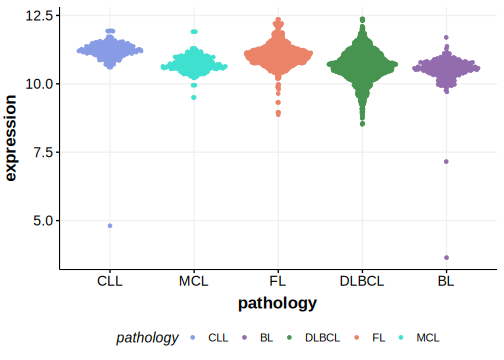

[[_TOC_]]

## Relevance tier by entity

[[include:table1_TAF1.md]]

## Mutation incidence in large patient cohorts (GAMBL reanalysis)

[[include:DLBCL_TAF1.md]]

## Mutation pattern and selective pressure estimates

[[include:dnds_TAF1.md]]

[[include:browser_TAF1.md]]

## Expression

<!-- ORIGIN: morinMutationalStructuralAnalysis2013 -->
<!-- MZL: spinaGeneticsNodalMarginal2016b -->
<!-- DLBCL: morinMutationalStructuralAnalysis2013 -->

[[include:mermaid_TAF1.md]]

## References
