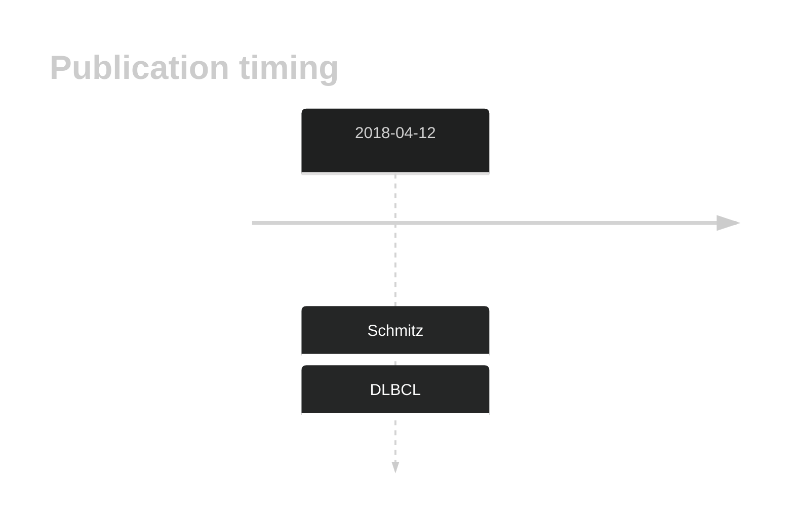
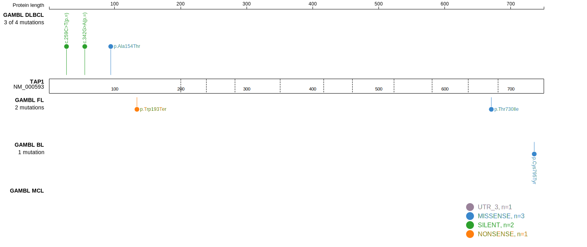
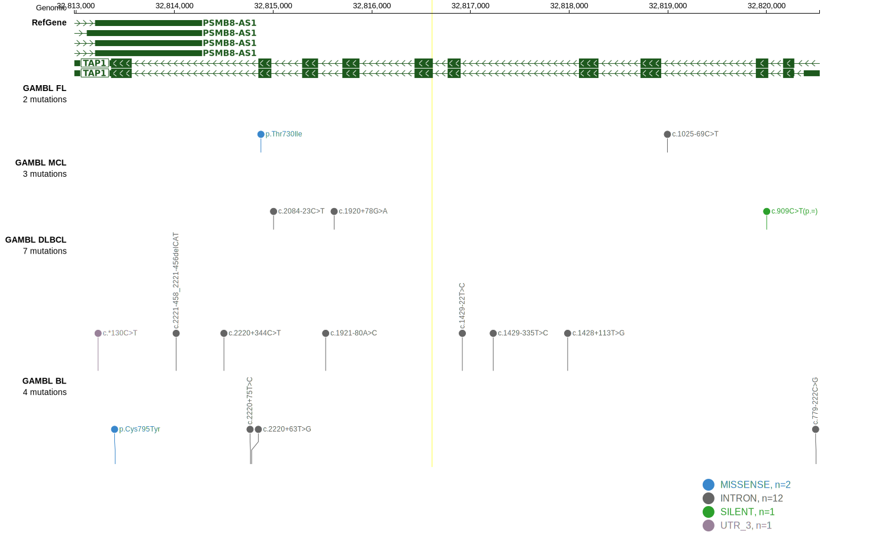
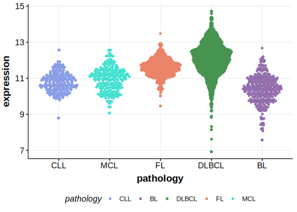

# TAP1

## History

## Relevance tier by entity

|Entity|Tier|Description                              |
|:------:|:----:|-----------------------------------------|
||1|high-confidence PMBL/cHL/GZL gene|
| |2   |relevance in DLBCL not firmly established[@schmitzGeneticsPathogenesisDiffuse2018]|

## Mutation incidence in large patient cohorts (GAMBL reanalysis)

|Entity|source        |frequency (%)|
|:------:|:--------------:|:-------------:|
|DLBCL |GAMBL genomes |0.57         |
|DLBCL |Schmitz cohort|3.62         |
|DLBCL |Reddy cohort  |  NA         |
|DLBCL |Chapuy cohort |2.56         |

## Mutation pattern and selective pressure estimates

|Entity|aSHM|Significant selection|dN/dS (missense)|dN/dS (nonsense)|
|:------:|:----:|:---------------------:|:----------------:|:----------------:|
|BL    |No  |No                   |0.986           | 0.000          |
|DLBCL |No  |No                   |0.632           | 0.000          |
|FL    |No  |No                   |3.142           |39.164          |

View coding variants in ProteinPaint [hg19](https://morinlab.github.io/LLMPP/GAMBL/TAP1_protein.html)  or [hg38](https://morinlab.github.io/LLMPP/GAMBL/TAP1_protein_hg38.html)

View all variants in GenomePaint [hg19](https://morinlab.github.io/LLMPP/GAMBL/TAP1.html)  or [hg38](https://morinlab.github.io/LLMPP/GAMBL/TAP1_hg38.html)

## TAP1 Expression

<!-- ORIGIN: schmitzGeneticsPathogenesisDiffuse2018a -->
<!-- DLBCL: schmitzGeneticsPathogenesisDiffuse2018a -->

## References

