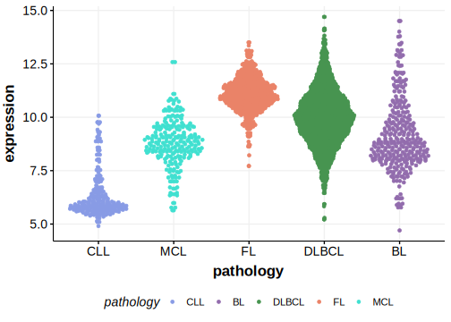

[[_TOC_]]

## Relevance tier by entity

[[include:tables/table1_TBC1D4.md]]

## Mutation incidence in large patient cohorts (GAMBL reanalysis)

|Entity|source        |frequency (%)|
|:------:|:--------------:|:-------------:|
|DLBCL |GAMBL genomes |2.29         |
|DLBCL |Schmitz cohort|5.11         |
|DLBCL |Reddy cohort  |2.70         |
|DLBCL |Chapuy cohort |5.56         |

## Mutation pattern and selective pressure estimates

[[include:tables/dnds_TBC1D4.md]]

## aSHM regions

|chr_name|hg19_start|hg19_end|region                                                                                       |regulatory_comment|
|:--------:|:----------:|:--------:|:---------------------------------------------------------------------------------------------:|:------------------:|
|chr13   |75982519  |75986015|[intron](https://genome.ucsc.edu/s/rdmorin/GAMBL%20hg19?position=chr13%3A75982519%2D75986015)|NA                |

[[include:tables/browser_TBC1D4.md]]

## Expression

<!-- ORIGIN: arthurGenomewideDiscoverySomatic2018 -->
<!-- DLBCL: arthurGenomewideDiscoverySomatic2018 -->

[[include:tables/mermaid_TBC1D4.md]]

## References
