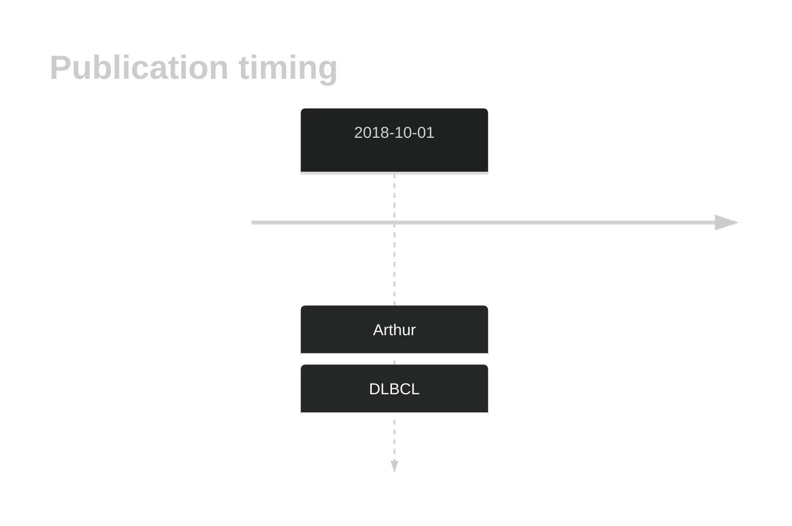

# TBC1D4

## History

## Relevance tier by entity

|Entity|Tier|Description                              |
|:------:|:----:|-----------------------------------------|
| |2-a | aSHM target; Although recurrent, the relevance of mutations in DLBCL is tenuous [@arthurGenomewideDiscoverySomatic2018]|

## Mutation incidence in large patient cohorts (GAMBL reanalysis)

|Entity|source        |frequency (%)|
|:------:|:--------------:|:-------------:|
|DLBCL |GAMBL genomes |2.29         |
|DLBCL |Schmitz cohort|5.11         |
|DLBCL |Reddy cohort  |2.70         |
|DLBCL |Chapuy cohort |5.56         |

## Mutation pattern and selective pressure estimates

|Entity|aSHM|Significant selection|dN/dS (missense)|dN/dS (nonsense)|
|:------:|:----:|:---------------------:|:----------------:|:----------------:|
|BL    |Yes |No                   |0.792           |0.000           |
|DLBCL |Yes |No                   |1.783           |6.266           |
|FL    |Yes |No                   |0.860           |0.000           |

## aSHM regions

|chr_name|hg19_start|hg19_end|region                                                                                       |regulatory_comment|
|:--------:|:----------:|:--------:|:---------------------------------------------------------------------------------------------:|:------------------:|
|chr13   |75982519  |75986015|[intron](https://genome.ucsc.edu/s/rdmorin/GAMBL%20hg19?position=chr13%3A75982519%2D75986015)|NA                |

View coding variants in ProteinPaint [hg19](https://morinlab.github.io/LLMPP/GAMBL/TBC1D4_protein.html)  or [hg38](https://morinlab.github.io/LLMPP/GAMBL/TBC1D4_protein_hg38.html)

View all variants in GenomePaint [hg19](https://morinlab.github.io/LLMPP/GAMBL/TBC1D4.html)  or [hg38](https://morinlab.github.io/LLMPP/GAMBL/TBC1D4_hg38.html)

## TBC1D4 Expression

<!-- ORIGIN: arthurGenomewideDiscoverySomatic2018 -->
<!-- DLBCL: arthurGenomewideDiscoverySomatic2018 -->

## References
