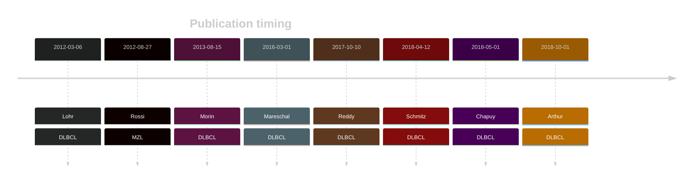

# TBL1XR1

## History

## Relevance tier by entity

|Entity|Tier|Description                           |
|:------:|:----:|--------------------------------------|
||1|high-confidence MZL gene[@rossiCodingGenomeSplenic2012]|
||1|high-confidence PMBL/cHL/GZL gene|
| |1   |high-confidence DLBCL gene            [@lohrDiscoveryPrioritizationSomatic2012; @morinMutationalStructuralAnalysis2013]|
|    |1   |high-confidence FL gene               |

## Mutation incidence in large patient cohorts (GAMBL reanalysis)

[[include:DLBCL_TBL1XR1.md]]
[[include:FL_TBL1XR1.md]]

## Mutation pattern and selective pressure estimates

|Entity|aSHM|Significant selection|dN/dS (missense)|dN/dS (nonsense)|
|:------:|:----:|:---------------------:|:----------------:|:----------------:|
|BL    |No  |Yes                  |17.892          |29.577          |
|DLBCL |No  |Yes                  |24.811          |24.179          |
|FL    |No  |No                   |12.400          |18.940          |

## TBL1XR1 Hotspots

| Chromosome |Coordinate (hg19) | ref>alt | HGVSp | 
 | :---:| :---: | :--: | :---: |
| chr3 | 176752066 | A>C | H390Q |
| chr3 | 176752053 | A>T | Y395N |
| chr3 | 176752053 | A>C | Y395D |
| chr3 | 176752052 | T>C | Y395C |
| chr3 | 176750839 | A>G | Y446H |
| chr3 | 176750838 | T>G | Y446S |
| chr3 | 176750838 | T>C | Y446C |
| chr3 | 176750836 | T>G | S447R |

View coding variants in ProteinPaint [hg19](https://morinlab.github.io/LLMPP/GAMBL/TBL1XR1_protein.html)  or [hg38](https://morinlab.github.io/LLMPP/GAMBL/TBL1XR1_protein_hg38.html)

View all variants in GenomePaint [hg19](https://morinlab.github.io/LLMPP/GAMBL/TBL1XR1.html)  or [hg38](https://morinlab.github.io/LLMPP/GAMBL/TBL1XR1_hg38.html)

## TBL1XR1 Expression

<!-- ORIGIN: rossiCodingGenomeSplenic2012c -->
<!-- MZL: rossiCodingGenomeSplenic2012c -->
<!-- DLBCL: mareschalWholeExomeSequencing2016 -->

## References

