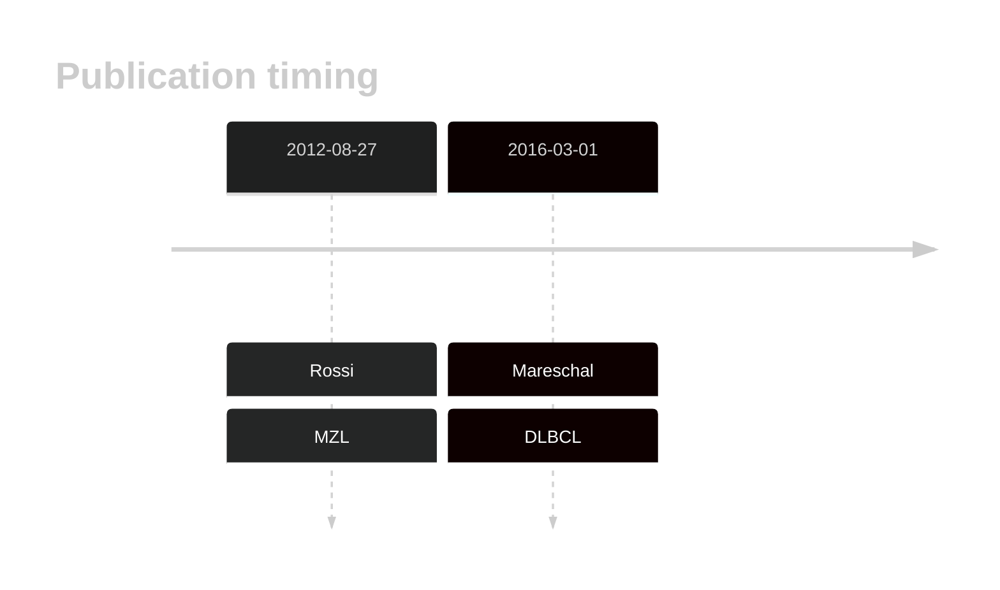
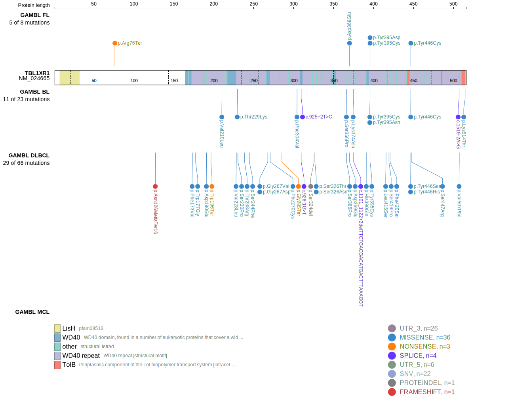
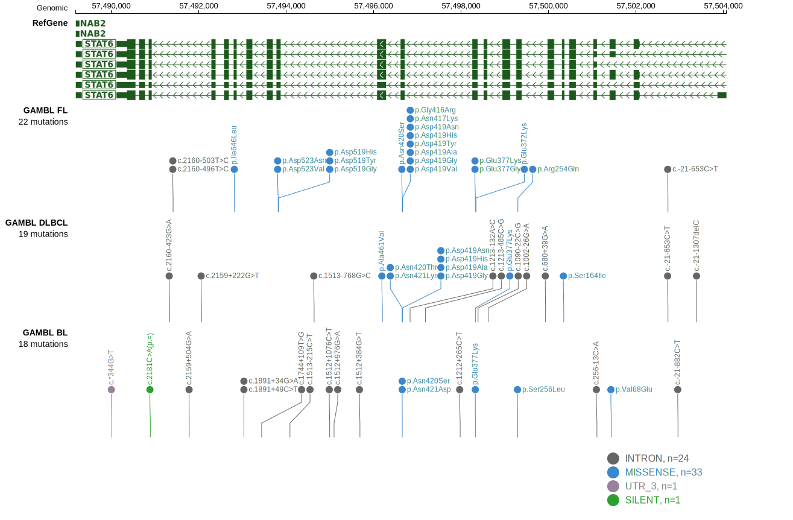
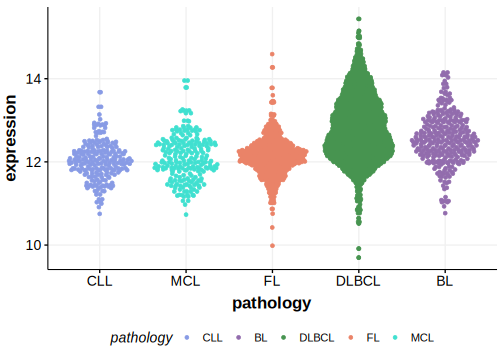

# TBL1XR1
## History

## Relevance tier by entity

|Entity|Tier|Description                           |
|:------:|:----:|--------------------------------------|
||1|high-confidence MZL gene|
||1|high-confidence PMBL/cHL/GZL gene|
| |1   |high-confidence DLBCL gene            |
|    |1   |high-confidence FL gene               |

## Mutation incidence in large patient cohorts (GAMBL reanalysis)

|Entity|source               |frequency (%)|
|:------:|:---------------------:|:-------------:|
|DLBCL |GAMBL genomes        | 8.60        |
|DLBCL |Schmitz cohort       |12.77        |
|DLBCL |Reddy cohort         | 5.71        |
|DLBCL |Chapuy cohort        | 8.12        |
|FL    |GAMBL genomes        | 3.93        |

## Mutation pattern and selective pressure estimates

|Entity|aSHM|Significant selection|dN/dS (missense)|dN/dS (nonsense)|
|:------:|:----:|:---------------------:|:----------------:|:----------------:|
|BL    |No  |Yes                  |17.892          |29.577          |
|DLBCL |No  |Yes                  |24.811          |24.179          |
|FL    |No  |No                   |12.400          |18.940          |

> [!NOTE]
> First described in DLBCL in 2016 by [Mareschal S](https://pubmed.ncbi.nlm.nih.gov/26608593)

 ## TBL1XR1 Hotspots

| Chromosome |Coordinate (hg19) | ref>alt | HGVSp | 
 | :---:| :---: | :--: | :---: |
| chr3 | 176752066 | A>C | H390Q |
| chr3 | 176752053 | A>T | Y395N |
| chr3 | 176752053 | A>C | Y395D |
| chr3 | 176752052 | T>C | Y395C |
| chr3 | 176750839 | A>G | Y446H |
| chr3 | 176750838 | T>G | Y446S |
| chr3 | 176750838 | T>C | Y446C |
| chr3 | 176750836 | T>G | S447R |

View coding variants in ProteinPaint [hg19](https://morinlab.github.io/LLMPP/GAMBL/TBL1XR1_protein.html)  or [hg38](https://morinlab.github.io/LLMPP/GAMBL/TBL1XR1_protein_hg38.html)

View all variants in GenomePaint [hg19](https://morinlab.github.io/LLMPP/GAMBL/TBL1XR1.html)  or [hg38](https://morinlab.github.io/LLMPP/GAMBL/TBL1XR1_hg38.html)

## TBL1XR1 Expression

<!-- ORIGIN: rossiCodingGenomeSplenic2012c -->
<!-- MZL: rossiCodingGenomeSplenic2012c -->
<!-- DLBCL: mareschalWholeExomeSequencing2016 -->
## References
1.  Rossi D, Trifonov V, Fangazio M, Bruscaggin A, Rasi S, Spina V, Monti S, Vaisitti T, Arruga F, Famà R, Ciardullo C, Greco M, Cresta S, Piranda D, Holmes A, Fabbri G, Messina M, Rinaldi A, Wang J, Agostinelli C, Piccaluga PP, Lucioni M, Tabbò F, Serra R, Franceschetti S, Deambrogi C, Daniele G, Gattei V, Marasca R, Facchetti F, Arcaini L, Inghirami G, Bertoni F, Pileri SA, Deaglio S, Foà R, Dalla-Favera R, Pasqualucci L, Rabadan R, Gaidano G. The coding genome of splenic marginal zone lymphoma: activation of NOTCH2 and other pathways regulating marginal zone development. J Exp Med. 2012 Aug 27;209(9):1537–1551. PMCID: PMC3428941
2.  Mareschal S, Dubois S, Viailly PJ, Bertrand P, Bohers E, Maingonnat C, Jaïs JP, Tesson B, Ruminy P, Peyrouze P, Copie-Bergman C, Fest T, Jo Molina T, Haioun C, Salles G, Tilly H, Lecroq T, Leroy K, Jardin F. Whole exome sequencing of relapsed/refractory patients expands the repertoire of somatic mutations in diffuse large B-cell lymphoma. Genes Chromosomes Cancer. 2016 Mar;55(3):251–267. PMID: 26608593
