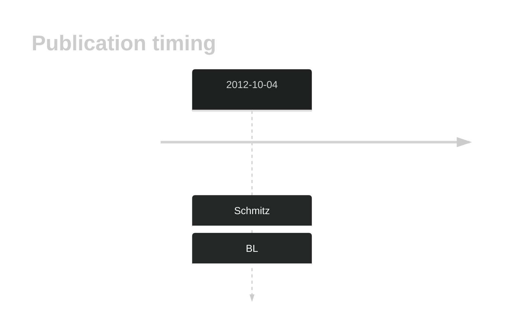

# TCF3

## History

## Relevance tier by entity

|Entity|Tier|Description            |
|:------:|:----:|-----------------------|
||1|high-confidence PMBL/cHL/GZL gene|
|    |1   |high-confidence BL gene|

## Mutation incidence in large patient cohorts (GAMBL reanalysis)

|Entity|source               |frequency (%)|
|:------:|:---------------------:|:-------------:|
|BL    |GAMBL genomes+capture|11.55        |
|BL    |Thomas cohort        |11.00        |
|BL    |Panea cohort         | 9.90        |

## Mutation pattern and selective pressure estimates

|Entity|aSHM|Significant selection|dN/dS (missense)|dN/dS (nonsense)|
|:------:|:----:|:---------------------:|:----------------:|:----------------:|
|BL    |No  |No                   |4.463           |34.108          |
|DLBCL |No  |No                   |1.567           | 0.000          |
|FL    |No  |No                   |0.000           | 0.000          |

## TCF3 Hotspots

| Chromosome |Coordinate (hg19) | ref>alt | HGVSp | 
 | :---:| :---: | :--: | :---: |
| chr19 | 1612366 | A>T | N551K |
| chr19 | 1612366 | A>C | N551K |
| chr19 | 1612349 | A>T | V557E |
| chr19 | 1612344 | C>T | V559M |
| chr19 | 1612337 | T>A | D561V |
| chr19 | 1612336 | A>T | D561E |
| chr19 | 1612336 | A>C | D561E |
| chr19 | 1612329 | C>T | E564K |

View coding variants in ProteinPaint [hg19](https://morinlab.github.io/LLMPP/GAMBL/TCF3_protein.html)  or [hg38](https://morinlab.github.io/LLMPP/GAMBL/TCF3_protein_hg38.html)

View all variants in GenomePaint [hg19](https://morinlab.github.io/LLMPP/GAMBL/TCF3.html)  or [hg38](https://morinlab.github.io/LLMPP/GAMBL/TCF3_hg38.html)

## TCF3 Expression

<!-- ORIGIN: schmitzBurkittLymphomaPathogenesis2012 -->
<!-- BL: schmitzBurkittLymphomaPathogenesis2012 -->

## References
1.  Schmitz R, Young RM, Ceribelli M, Jhavar S, Xiao W, Zhang M, Wright G, Shaffer AL, Hodson DJ, Buras E, Liu X, Powell J, Yang Y, Xu W, Zhao H, Kohlhammer H, Rosenwald A, Kluin P, Müller-Hermelink HK, Ott G, Gascoyne RD, Connors JM, Rimsza LM, Campo E, Jaffe ES, Delabie J, Smeland EB, Ogwang MD, Reynolds SJ, Fisher RI, Braziel RM, Tubbs RR, Cook JR, Weisenburger DD, Chan WC, Pittaluga S, Wilson W, Waldmann TA, Rowe M, Mbulaiteye SM, Rickinson AB, Staudt LM. Burkitt lymphoma pathogenesis and therapeutic targets from structural and functional genomics. Nature. 2012 Oct 4;490(7418):116–120. PMCID: PMC3609867
