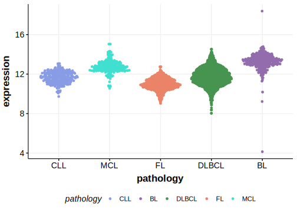

[[_TOC_]]

## Experimental Evidence

Driver mutations affecting this gene in BL have been experimentally demonstrated to cause a gain of function (GOF).[@schmitzBurkittLymphomaPathogenesis2012]

## Relevance tier by entity

[[include:table1_TCF3.md]]

## Mutation incidence in large patient cohorts (GAMBL reanalysis)

[[include:tables/DLBCL_TCF3.md]]
[[include:tables/BL_TCF3.md]]

## Mutation pattern and selective pressure estimates

[[include:tables/dnds_TCF3.md]]

## TCF3 Hotspots

| Chromosome |Coordinate (hg19) | ref>alt | HGVSp | 
 | :---:| :---: | :--: | :---: |
| chr19 | 1612366 | A>T | N551K |
| chr19 | 1612366 | A>C | N551K |
| chr19 | 1612349 | A>T | V557E |
| chr19 | 1612344 | C>T | V559M |
| chr19 | 1612337 | T>A | D561V |
| chr19 | 1612336 | A>T | D561E |
| chr19 | 1612336 | A>C | D561E |
| chr19 | 1612329 | C>T | E564K |

[[include:browser_TCF3.md]]

## Expression

<!-- ORIGIN: schmitzBurkittLymphomaPathogenesis2012 -->
<!-- BL: schmitzBurkittLymphomaPathogenesis2012 -->

[[include:mermaid_TCF3.md]]

# References
