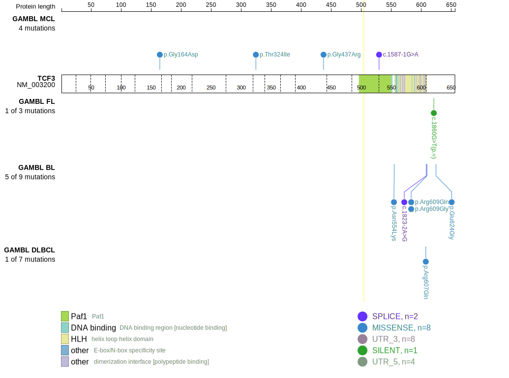
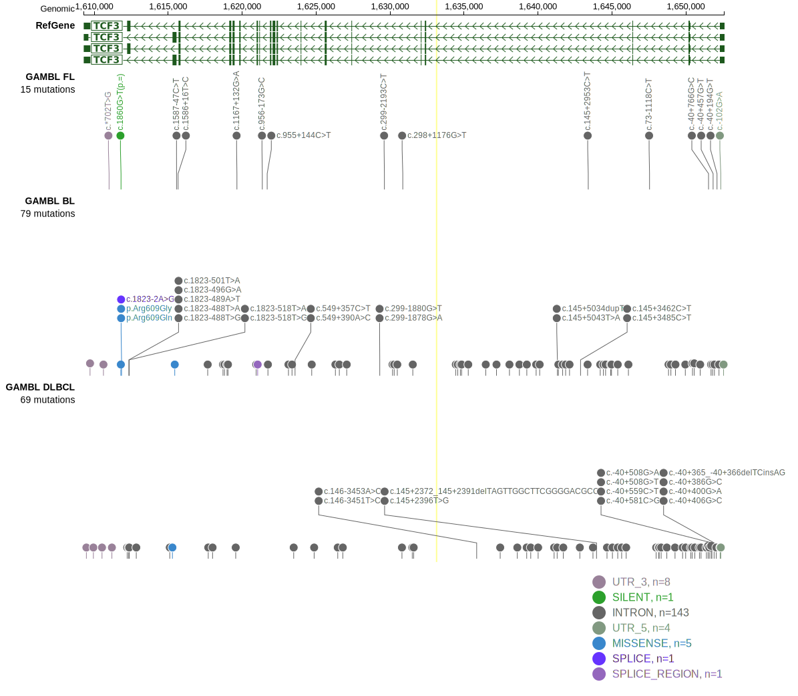

[[_TOC_]]

## Relevance tier by entity

|Entity|Tier|Description            |
|:------:|:----:|-----------------------|
||1|high-confidence PMBL/cHL/GZL gene|
|    |1   |high-confidence BL gene[@schmitzBurkittLymphomaPathogenesis2012]|

## Mutation incidence in large patient cohorts (GAMBL reanalysis)

[[include:DLBCL_TCF3.md]]
[[include:BL_TCF3.md]]

## Mutation pattern and selective pressure estimates

[[include:dnds_TCF3.md]]

## TCF3 Hotspots

| Chromosome |Coordinate (hg19) | ref>alt | HGVSp | 
 | :---:| :---: | :--: | :---: |
| chr19 | 1612366 | A>T | N551K |
| chr19 | 1612366 | A>C | N551K |
| chr19 | 1612349 | A>T | V557E |
| chr19 | 1612344 | C>T | V559M |
| chr19 | 1612337 | T>A | D561V |
| chr19 | 1612336 | A>T | D561E |
| chr19 | 1612336 | A>C | D561E |
| chr19 | 1612329 | C>T | E564K |

View coding variants in ProteinPaint [hg19](https://morinlab.github.io/LLMPP/GAMBL/TCF3_protein.html)  or [hg38](https://morinlab.github.io/LLMPP/GAMBL/TCF3_protein_hg38.html)

View all variants in GenomePaint [hg19](https://morinlab.github.io/LLMPP/GAMBL/TCF3.html)  or [hg38](https://morinlab.github.io/LLMPP/GAMBL/TCF3_hg38.html)

## TCF3 Expression

<!-- ORIGIN: schmitzBurkittLymphomaPathogenesis2012 -->
<!-- BL: schmitzBurkittLymphomaPathogenesis2012 -->

[[include:mermaid_TCF3.md]]

# References
