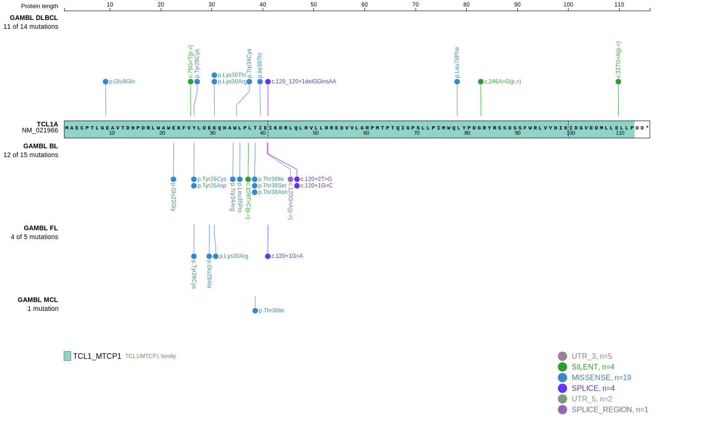
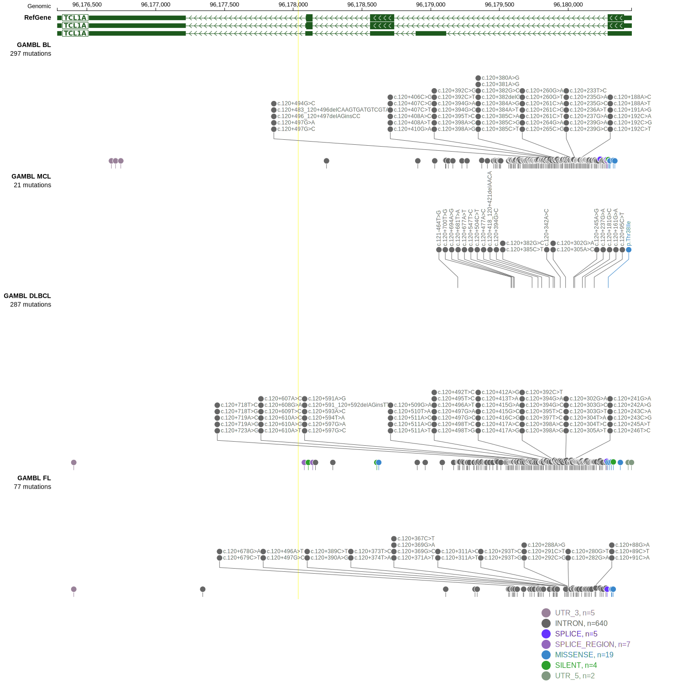

# [TCL1A]

## Mutation tier

|Entity|Tier|Description                              |
|:------:|:----:|-----------------------------------------|
|BL    |2   |relevance in BL not firmly established   |
|DLBCL |2   |relevance in DLBCL not firmly established|
## Mutation incidence

|Entity|source               |frequency (%)|
|:------:|:---------------------:|:-------------:|
|BL    |GAMBL genomes+capture|4.16         |
|BL    |Thomas cohort        |5.90         |
|BL    |Panea cohort         |4.00         |
|DLBCL |GAMBL genomes        |2.10         |
|DLBCL |Schmitz cohort       |3.80         |
|DLBCL |Reddy cohort         |2.80         |
|DLBCL |Chapuy cohort        |3.00         |

## Mutation pattern

|Entity|aSHM|Significant selection|dN/dS (missense)|dN/dS (nonsense)|
|:------:|:----:|:---------------------:|:----------------:|:----------------:|
|BL    |Yes |Yes                  |13.813          | 49.800         |
|DLBCL |Yes |Yes                  |25.501          |112.487         |
|FL    |Yes |No                   |30.159          | 88.355         |

## aSHM regions

|chr_name|hg19_start|hg19_end|region                                                                                    |regulatory_comment|
|:--------:|:----------:|:--------:|:------------------------------------------------------------------------------------------:|:------------------:|
|chr14   |96179535  |96180366|[TSS](https://genome.ucsc.edu/s/rdmorin/GAMBL%20hg19?position=chr14%3A96179535%2D96180366)|active_promoter   |

> [!NOTE]
> First described in BL in 2019 by [Grande BM](https://pubmed.ncbi.nlm.nih.gov/30617194)

View coding variants in ProteinPaint [hg19](https://www.bcgsc.ca/downloads/morinlab/GAMBL/test/genes/TCL1A_protein.html)  or [hg38](https://www.bcgsc.ca/downloads/morinlab/GAMBL/test/genes/TCL1A_protein_hg38.html)

View all variants in GenomePaint [hg19](https://www.bcgsc.ca/downloads/morinlab/GAMBL/test/genes/TCL1A.html)  or [hg38](https://www.bcgsc.ca/downloads/morinlab/GAMBL/test/genes/TCL1A_hg38.html)

