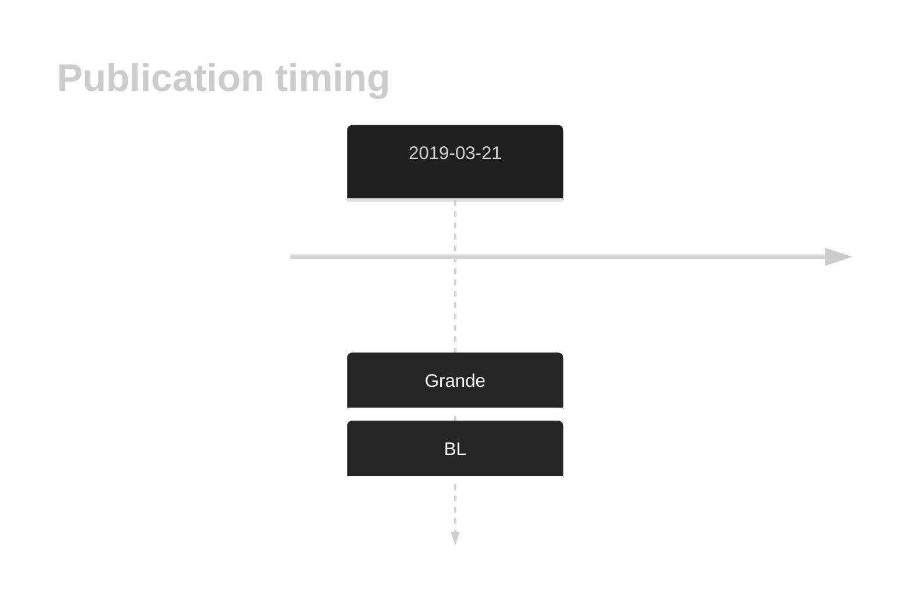

# TCL1A

## History

## Relevance tier by entity

|Entity|Tier|Description                              |
|:------:|:----:|-----------------------------------------|
|    |1-a | aSHM target and high-confidence BL gene   [@grandeGenomewideDiscoverySomatic2019]|
| |1-a | aSHM target and high-confidence DLBCL gene|

## Mutation incidence in large patient cohorts (GAMBL reanalysis)

[[include:DLBCL_TCL1A.md]]
[[include:BL_TCL1A.md]]

## Mutation pattern and selective pressure estimates

[[include:dnds_TCL1A.md]]

## aSHM regions

|chr_name|hg19_start|hg19_end|region                                                                                    |regulatory_comment|
|:--------:|:----------:|:--------:|:------------------------------------------------------------------------------------------:|:------------------:|
|chr14   |96179535  |96180366|[TSS](https://genome.ucsc.edu/s/rdmorin/GAMBL%20hg19?position=chr14%3A96179535%2D96180366)|active_promoter   |

View coding variants in ProteinPaint [hg19](https://morinlab.github.io/LLMPP/GAMBL/TCL1A_protein.html)  or [hg38](https://morinlab.github.io/LLMPP/GAMBL/TCL1A_protein_hg38.html)

View all variants in GenomePaint [hg19](https://morinlab.github.io/LLMPP/GAMBL/TCL1A.html)  or [hg38](https://morinlab.github.io/LLMPP/GAMBL/TCL1A_hg38.html)

## TCL1A Expression

## References

<!-- ORIGIN: grandeGenomewideDiscoverySomatic2019 -->
<!-- BL: grandeGenomewideDiscoverySomatic2019 -->
