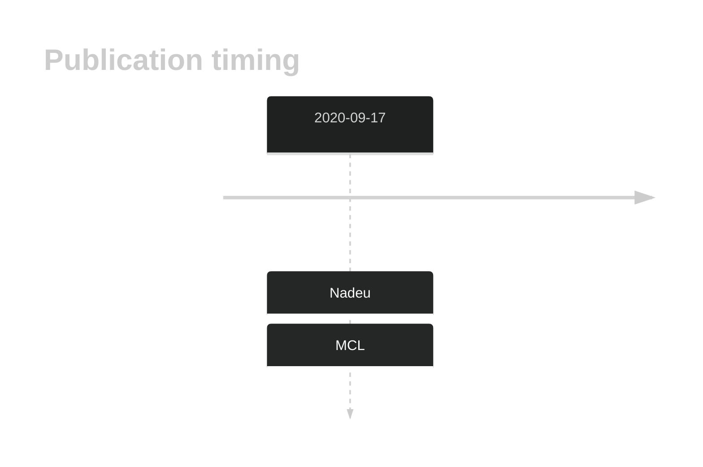
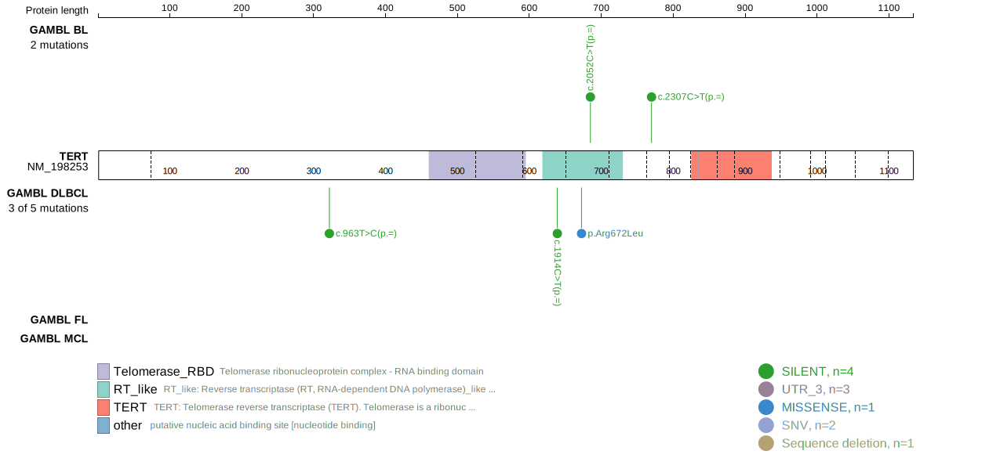
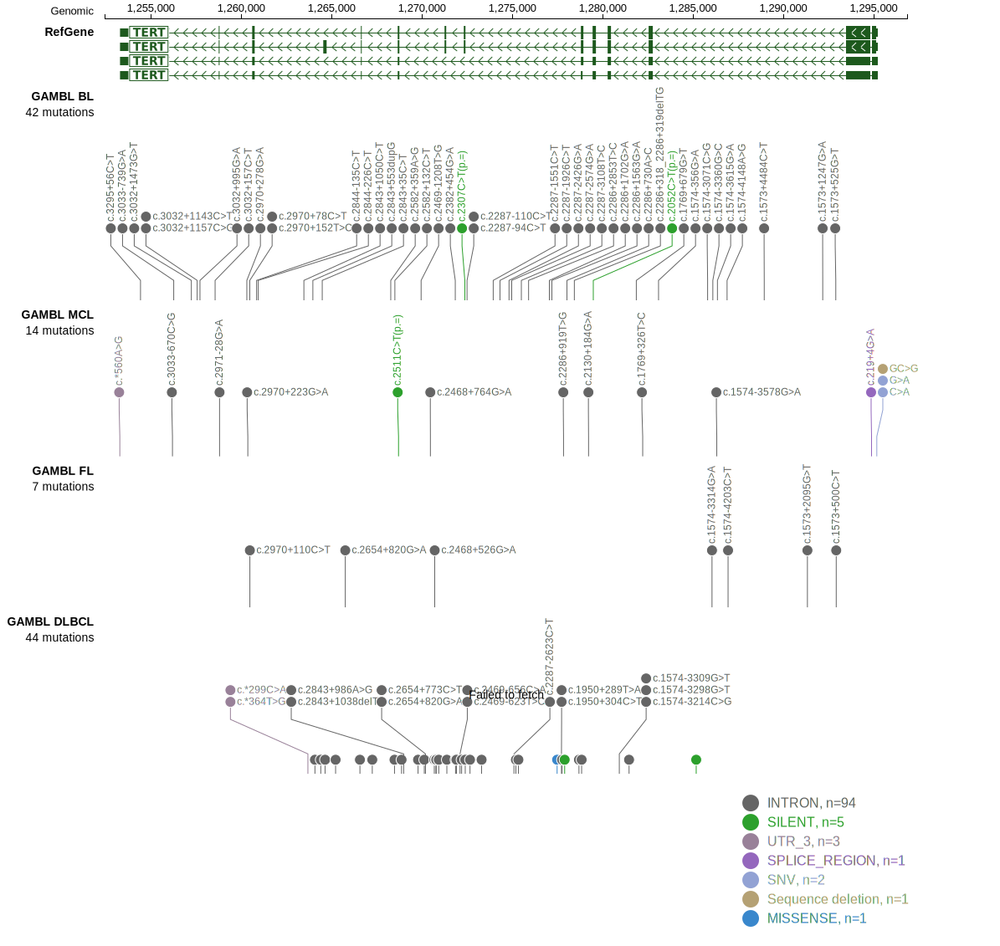

# TERT
## History

## Relevance tier by entity

|Entity|Tier|Description             |
|:------:|:----:|------------------------|
|   |1   |high-confidence MCL gene|

## Mutation incidence in large patient cohorts (GAMBL reanalysis)

|Entity|source       |frequency (%)|
|:------:|:-------------:|:-------------:|
|MCL   |GAMBL genomes|0            |

## Mutation pattern and selective pressure estimates

|Entity|aSHM|Significant selection|dN/dS (missense)|dN/dS (nonsense)|
|:------:|:----:|:---------------------:|:----------------:|:----------------:|
|BL    |No  |No                   |0.000           |0               |
|DLBCL |No  |No                   |1.429           |0               |
|FL    |No  |No                   |0.000           |0               |

> [!NOTE]
> First described in MCL in 2020 by [Nadeu F](https://pubmed.ncbi.nlm.nih.gov/32584970)

View coding variants in ProteinPaint [hg19](https://morinlab.github.io/LLMPP/GAMBL/TERT_protein.html)  or [hg38](https://morinlab.github.io/LLMPP/GAMBL/TERT_protein_hg38.html)

View all variants in GenomePaint [hg19](https://morinlab.github.io/LLMPP/GAMBL/TERT.html)  or [hg38](https://morinlab.github.io/LLMPP/GAMBL/TERT_hg38.html)

## TERT Expression

<!-- ORIGIN: nadeuGenomicEpigenomicInsights2020a -->
<!-- MCL: nadeuGenomicEpigenomicInsights2020a -->
## References
1.  Nadeu F, Martín-García D, Clot G, Díaz-Navarro A, Duran-Ferrer M, Navarro A, Vilarrasa-Blasi R, Kulis M, Royo R, Gutiérrez-Abril J, Valdés-Mas R, López C, Chapaprieta V, Puiggrós M, Castellano G, Costa D, Aymerich M, Jares P, Espinet B, Muntañola A, Ribera‐Cortada I, Siebert R, Colomer D, Torrents D, Giné E, López-Guillermo A, Küppers R, Martín-Subero J, Puente X, Beà S, Campo E. Genomic and epigenomic insights into the origin, pathogenesis and clinical behavior of mantle cell lymphoma subtypes. Blood. 2020; 
