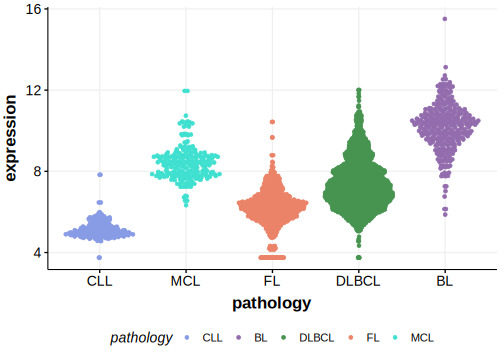

[[_TOC_]]

## Overview

Non-coding mutations in the promoter of this gene have been described in MCL.

## Relevance tier by entity

[[include:tables/table1_TERT.md]]

## Mutation incidence in large patient cohorts (GAMBL reanalysis)

### MCL
[[include:tables/MCL_TERT.md]]

<!---
## Mutation pattern and selective pressure estimates
-->

[[include:browser_TERT.md]]

## Expression

<!-- ORIGIN: nadeuGenomicEpigenomicInsights2020a -->
<!-- MCL: nadeuGenomicEpigenomicInsights2020b -->

[[include:tables/mermaid_TERT.md]]

## References

