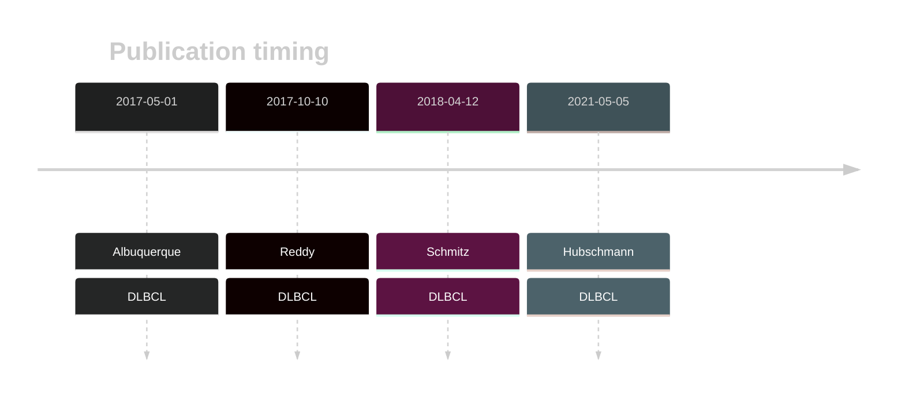

# TET2

## History

## Relevance tier by entity

|Entity|Tier|Description                           |
|:------:|:----:|--------------------------------------|
| |1   |high-confidence DLBCL gene            [@albuquerqueEnhancingKnowledgeDiscovery2017]|

## Mutation incidence in large patient cohorts (GAMBL reanalysis)

[[include:DLBCL_TET2.md]]

## Mutation pattern and selective pressure estimates

[[include:dnds_TET2.md]]

View coding variants in ProteinPaint [hg19](https://morinlab.github.io/LLMPP/GAMBL/TET2_protein.html)  or [hg38](https://morinlab.github.io/LLMPP/GAMBL/TET2_protein_hg38.html)

View all variants in GenomePaint [hg19](https://morinlab.github.io/LLMPP/GAMBL/TET2.html)  or [hg38](https://morinlab.github.io/LLMPP/GAMBL/TET2_hg38.html)

## TET2 Expression

<!-- ORIGIN: 28327945 -->
<!-- DLBCL: albuquerqueEnhancingKnowledgeDiscovery2017a -->

## References

