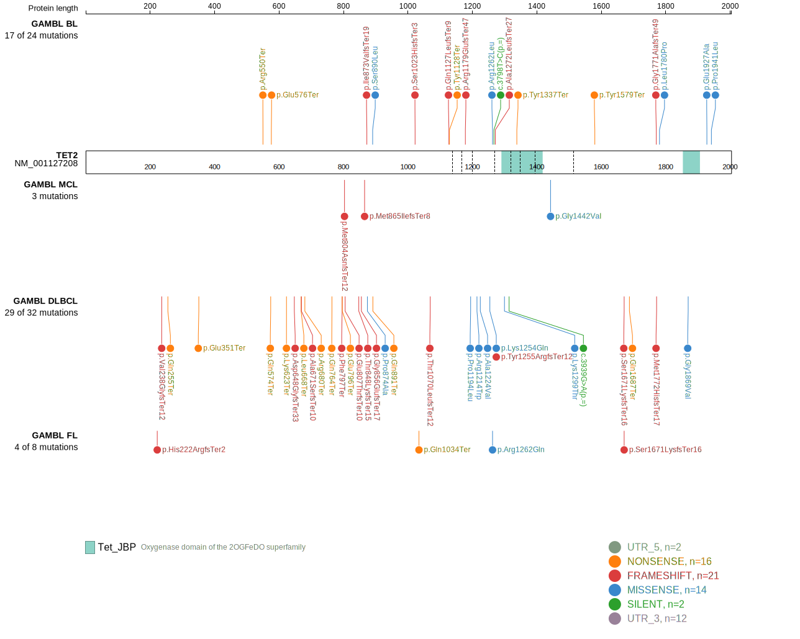
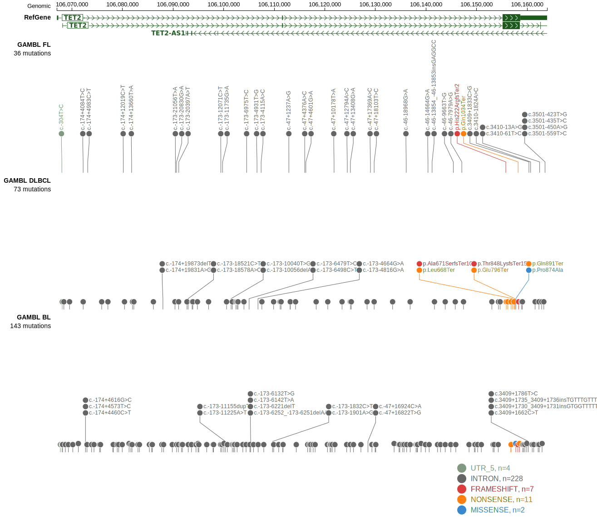

# [TET2]

## Mutation tier

|Entity|Tier|Description                           |
|:------:|:----:|--------------------------------------|
|BL    |2   |relevance in BL not firmly established|
|DLBCL |1   |high-confidence DLBCL gene            |
## Mutation incidence

|Entity|source               |frequency (%)|
|:------:|:---------------------:|:-------------:|
|BL    |GAMBL genomes+capture| 5.31        |
|BL    |Thomas cohort        | 5.10        |
|BL    |Panea cohort         |10.90        |
|DLBCL |GAMBL genomes        | 5.54        |
|DLBCL |Schmitz cohort       |11.70        |
|DLBCL |Reddy cohort         | 7.41        |
|DLBCL |Chapuy cohort        | 5.98        |

## Mutation pattern

|Entity|aSHM|Significant selection|dN/dS (missense)|dN/dS (nonsense)|
|:------:|:----:|:---------------------:|:----------------:|:----------------:|
|BL    |No  |Yes                  |1.516           |25.932          |
|DLBCL |No  |Yes                  |0.663           |12.181          |
|FL    |No  |No                   |0.892           |10.949          |

> [!NOTE]
> First described in BL in 2019 by [Panea RI](https://pubmed.ncbi.nlm.nih.gov/31558468)

View coding variants in ProteinPaint [hg19](https://www.bcgsc.ca/downloads/morinlab/GAMBL/test/genes/TET2_protein.html)  or [hg38](https://www.bcgsc.ca/downloads/morinlab/GAMBL/test/genes/TET2_protein_hg38.html)

View all variants in GenomePaint [hg19](https://www.bcgsc.ca/downloads/morinlab/GAMBL/test/genes/TET2.html)  or [hg38](https://www.bcgsc.ca/downloads/morinlab/GAMBL/test/genes/TET2_hg38.html)

