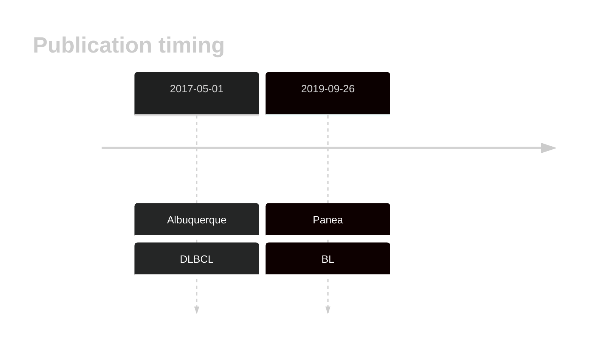

# TET2
## History

## Relevance tier by entity

|Entity|Tier|Description                           |
|:------:|:----:|--------------------------------------|
|    |2   |relevance in BL not firmly established|
| |1   |high-confidence DLBCL gene            |

## Mutation incidence in large patient cohorts (GAMBL reanalysis)

|Entity|source               |frequency (%)|
|:------:|:---------------------:|:-------------:|
|BL    |GAMBL genomes+capture| 5.31        |
|BL    |Thomas cohort        | 5.10        |
|BL    |Panea cohort         |10.90        |
|DLBCL |GAMBL genomes        | 5.54        |
|DLBCL |Schmitz cohort       |11.70        |
|DLBCL |Reddy cohort         | 7.41        |
|DLBCL |Chapuy cohort        | 5.98        |

## Mutation pattern and selective pressure estimates

|Entity|aSHM|Significant selection|dN/dS (missense)|dN/dS (nonsense)|
|:------:|:----:|:---------------------:|:----------------:|:----------------:|
|BL    |No  |Yes                  |1.516           |25.932          |
|DLBCL |No  |Yes                  |0.663           |12.181          |
|FL    |No  |No                   |0.892           |10.949          |

> [!NOTE]
> First described in BL in 2019 by [Panea RI](https://pubmed.ncbi.nlm.nih.gov/31558468)

View coding variants in ProteinPaint [hg19](https://morinlab.github.io/LLMPP/GAMBL/TET2_protein.html)  or [hg38](https://morinlab.github.io/LLMPP/GAMBL/TET2_protein_hg38.html)

View all variants in GenomePaint [hg19](https://morinlab.github.io/LLMPP/GAMBL/TET2.html)  or [hg38](https://morinlab.github.io/LLMPP/GAMBL/TET2_hg38.html)

## TET2 Expression

<!-- ORIGIN: 28327945 -->
<!-- BL: paneaWholeGenomeLandscape2019 -->
<!-- DLBCL: albuquerqueEnhancingKnowledgeDiscovery2017a -->
## References
1.  Albuquerque MA, Grande BM, Ritch EJ, Pararajalingam P, Jessa S, Krzywinski M, Grewal JK, Shah SP, Boutros PC, Morin RD. Enhancing knowledge discovery from cancer genomics data with Galaxy. Gigascience. 2017 May 1;6(5):1–13. PMCID: PMC5437943
2.  Panea R, Love C, Shingleton JR, Reddy A, Bailey J, Moormann A, Otieno J, Ong’echa J, Oduor C, Schroêder K, Masalu N, Chao N, Agajanian M, Major M, Fedoriw Y, Richards K, Rymkiewicz G, Miles R, Alobeid B, Bhagat G, Flowers C, Ondrejka S, Hsi E, Choi W, Au-Yeung R, Hartmann W, Lenz G, Meyerson H, Lin YY, Zhuang Y, Luftig M, Waldrop A, Dave T, Thakkar D, Sahay H, Li G, Palus B, Seshadri V, Kim S, Gascoyne R, Levy S, Mukhopadhyay M, Dunson D, Dave S. The whole genome landscape of Burkitt lymphoma subtypes. Blood. 2019; 
