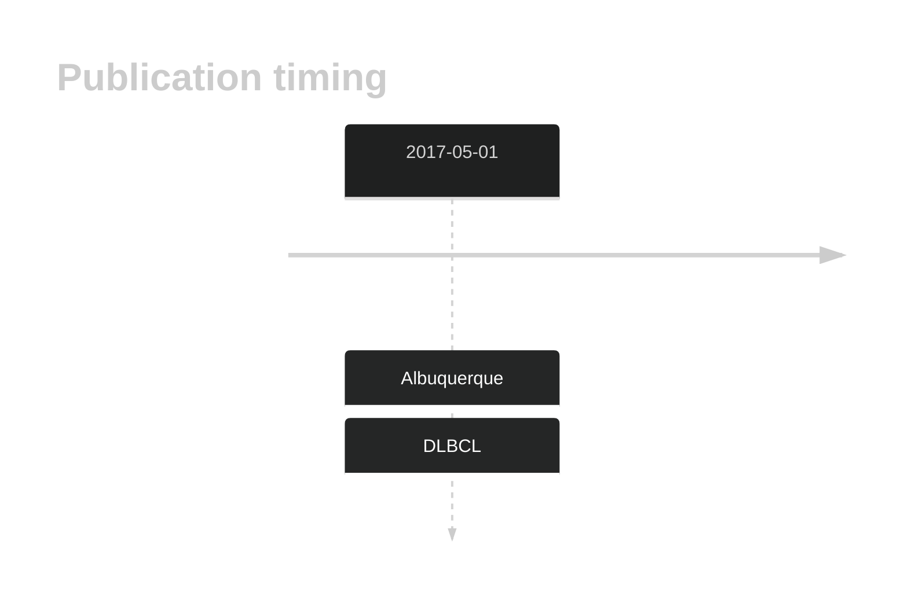

# TET2

## History

## Relevance tier by entity

|Entity|Tier|Description                           |
|:------:|:----:|--------------------------------------|
| |1   |high-confidence DLBCL gene            |

## Mutation incidence in large patient cohorts (GAMBL reanalysis)

|Entity|source               |frequency (%)|
|:------:|:---------------------:|:-------------:|
|DLBCL |GAMBL genomes        | 5.54        |
|DLBCL |Schmitz cohort       |11.70        |
|DLBCL |Reddy cohort         | 7.41        |
|DLBCL |Chapuy cohort        | 5.98        |

## Mutation pattern and selective pressure estimates

|Entity|aSHM|Significant selection|dN/dS (missense)|dN/dS (nonsense)|
|:------:|:----:|:---------------------:|:----------------:|:----------------:|
|BL    |No  |Yes                  |1.516           |25.932          |
|DLBCL |No  |Yes                  |0.663           |12.181          |
|FL    |No  |No                   |0.892           |10.949          |

View coding variants in ProteinPaint [hg19](https://morinlab.github.io/LLMPP/GAMBL/TET2_protein.html)  or [hg38](https://morinlab.github.io/LLMPP/GAMBL/TET2_protein_hg38.html)

View all variants in GenomePaint [hg19](https://morinlab.github.io/LLMPP/GAMBL/TET2.html)  or [hg38](https://morinlab.github.io/LLMPP/GAMBL/TET2_hg38.html)

## TET2 Expression

<!-- ORIGIN: 28327945 -->
<!-- DLBCL: albuquerqueEnhancingKnowledgeDiscovery2017a -->

## References

1.  **Albuquerque MA, Grande BM, Ritch EJ, Pararajalingam P, Jessa S, Krzywinski M, Grewal JK, Shah SP, Boutros PC, Morin RD. Enhancing knowledge discovery from cancer genomics data with Galaxy. Gigascience. 2017 May 1;6(5):1–13. PMCID: PMC5437943**
