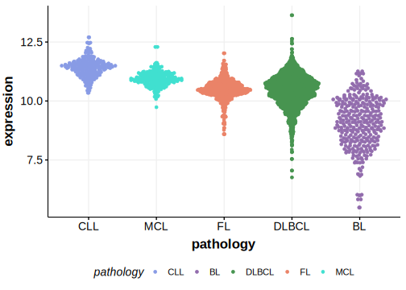

[[_TOC_]]

## Experimental Evidence

Driver mutations affecting this gene in DLBCL have been experimentally demonstrated to cause a reduction or loss of function (LOF).[@asmarGenomewideProfilingIdentifies2013]

## Relevance tier by entity

[[include:table1_TET2.md]]

## Mutation incidence in large patient cohorts (GAMBL reanalysis)

### DLBCL
[[include:DLBCL_TET2.md]]

## Mutation pattern and selective pressure estimates

[[include:dnds_TET2.md]]

[[include:browser_TET2.md]]

## Expression

<!-- ORIGIN: 28327945 -->
<!-- DLBCL: albuquerqueEnhancingKnowledgeDiscovery2017a -->

[[include:mermaid_TET2.md]]

## References

