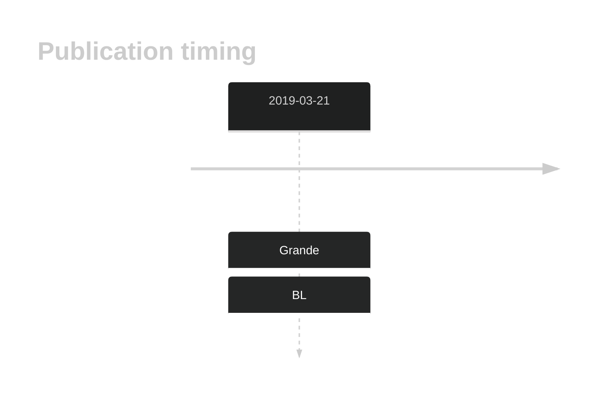

# TFAP4

## History
Mutations in BL were first described by Grande et al.1

## Relevance tier by entity

|Entity|Tier|Description            |
|:------:|:----:|-----------------------|
|    |1   |high-confidence BL gene[@grandeGenomewideDiscoverySomatic2019]|

## Mutation incidence in large patient cohorts (GAMBL reanalysis)

[[include:DLBCL_TFAP4.md]]
[[include:BL_TFAP4.md]]

## Mutation pattern and selective pressure estimates

|Entity|aSHM|Significant selection|dN/dS (missense)|dN/dS (nonsense)|
|:------:|:----:|:---------------------:|:----------------:|:----------------:|
|BL    |No  |Yes                  |16.997          |47.948          |
|DLBCL |No  |No                   | 5.215          | 0.000          |
|FL    |No  |No                   | 0.000          | 0.000          |

View coding variants in ProteinPaint [hg19](https://morinlab.github.io/LLMPP/GAMBL/TFAP4_protein.html)  or [hg38](https://morinlab.github.io/LLMPP/GAMBL/TFAP4_protein_hg38.html)

View all variants in GenomePaint [hg19](https://morinlab.github.io/LLMPP/GAMBL/TFAP4.html)  or [hg38](https://morinlab.github.io/LLMPP/GAMBL/TFAP4_hg38.html)

## TFAP4 Expression

## References

<!-- ORIGIN: grandeGenomewideDiscoverySomatic2019 -->
<!-- BL: grandeGenomewideDiscoverySomatic2019 -->
