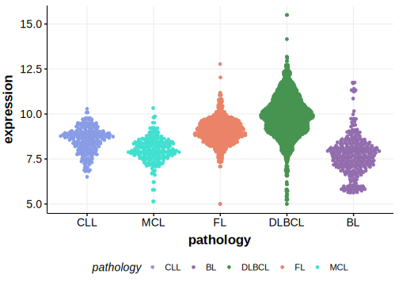

[[_TOC_]]

## Relevance tier by entity

[[include:table1_TLR2.md]]

## Mutation incidence in large patient cohorts (GAMBL reanalysis)

|Entity|source        |frequency (%)|
|:------:|:--------------:|:-------------:|
|DLBCL |GAMBL genomes |2.87         |
|DLBCL |Schmitz cohort|2.77         |
|DLBCL |Reddy cohort  |1.50         |
|DLBCL |Chapuy cohort |2.99         |
|MCL   |GAMBL genomes |0.00         |

## Mutation pattern and selective pressure estimates

[[include:tables/dnds_TLR2.md]]

## TLR2 Hotspots

| Chromosome |Coordinate (hg19) | ref>alt | HGVSp | 
 | :---:| :---: | :--: | :---: |
| chr4 | 154625039 | A>T | D327V |
| chr4 | 154625042 | T>G | L328R |

[[include:browser_TLR2.md]]

## Expression

<!-- ORIGIN: beaLandscapeSomaticMutations2013 -->
<!-- DLBCL: chapuyMolecularSubtypesDiffuse2018b -->
<!-- MCL: beaLandscapeSomaticMutations2013 -->

## All Mutations

[DLBCL-RICOVER_1269-Tumor](https://bcgsc.ca/downloads/morinlab/GAMBL/Chapuy_2018/DLBCL-RICOVER_1269-Tumor.html)
[DLBCL-RICOVER_174-Tumor](https://bcgsc.ca/downloads/morinlab/GAMBL/Chapuy_2018/DLBCL-RICOVER_174-Tumor.html)

[[include:mermaid_TLR2.md]]

## References

