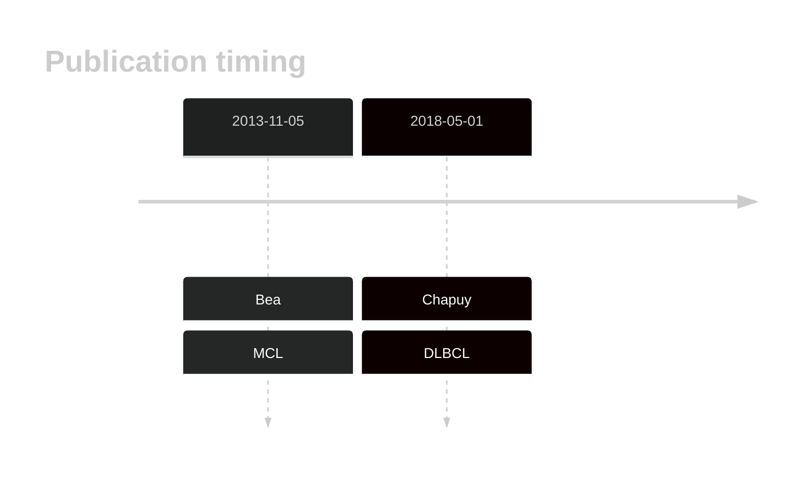

# TLR2

## History

## Relevance tier by entity

|Entity|Tier|Description                              |
|:------:|:----:|-----------------------------------------|
| |2   |relevance in DLBCL not firmly established[@chapuyMolecularSubtypesDiffuse2018b]|
|   |1   |high-confidence MCL gene                 [@beaLandscapeSomaticMutations2013]|

## Mutation incidence in large patient cohorts (GAMBL reanalysis)

|Entity|source        |frequency (%)|
|:------:|:--------------:|:-------------:|
|DLBCL |GAMBL genomes |2.87         |
|DLBCL |Schmitz cohort|2.77         |
|DLBCL |Reddy cohort  |1.50         |
|DLBCL |Chapuy cohort |2.99         |
|MCL   |GAMBL genomes |0.00         |

## Mutation pattern and selective pressure estimates

|Entity|aSHM|Significant selection|dN/dS (missense)|dN/dS (nonsense)|
|:------:|:----:|:---------------------:|:----------------:|:----------------:|
|BL    |No  |No                   |1.141           |0               |
|DLBCL |No  |No                   |3.705           |0               |
|FL    |No  |No                   |0.000           |0               |

## TLR2 Hotspots

| Chromosome |Coordinate (hg19) | ref>alt | HGVSp | 
 | :---:| :---: | :--: | :---: |
| chr4 | 154625039 | A>T | D327V |
| chr4 | 154625042 | T>G | L328R |

View coding variants in ProteinPaint [hg19](https://morinlab.github.io/LLMPP/GAMBL/TLR2_protein.html)  or [hg38](https://morinlab.github.io/LLMPP/GAMBL/TLR2_protein_hg38.html)

View all variants in GenomePaint [hg19](https://morinlab.github.io/LLMPP/GAMBL/TLR2.html)  or [hg38](https://morinlab.github.io/LLMPP/GAMBL/TLR2_hg38.html)

## TLR2 Expression

<!-- ORIGIN: beaLandscapeSomaticMutations2013 -->
<!-- DLBCL: chapuyMolecularSubtypesDiffuse2018b -->
<!-- MCL: beaLandscapeSomaticMutations2013 -->

## References

