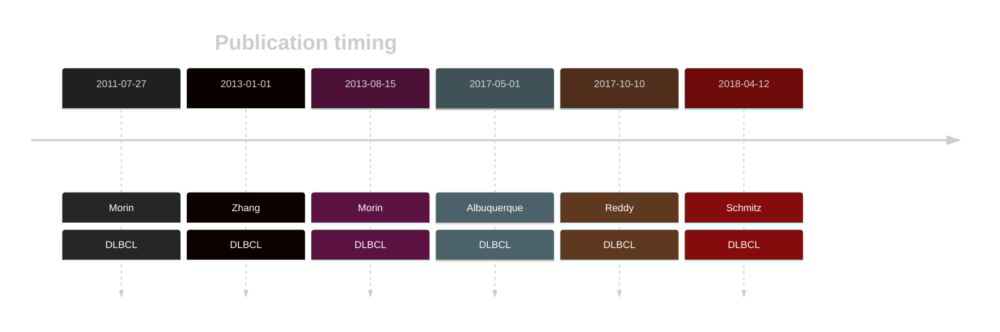

# TMEM30A

## History

## Relevance tier by entity

|Entity|Tier|Description                           |
|:------:|:----:|--------------------------------------|
| |1   |high-confidence DLBCL gene            [@morinFrequentMutationHistonemodifying2011; @zhangGeneticHeterogeneityDiffuse2013; @morinMutationalStructuralAnalysis2013]|
|    |2   |relevance in FL not firmly established[@morinFrequentMutationHistonemodifying2011]|

## Mutation incidence in large patient cohorts (GAMBL reanalysis)

[[include:DLBCL_TMEM30A.md]]
[[include:FL_TMEM30A.md]]

## Mutation pattern and selective pressure estimates

[[include:dnds_TMEM30A.md]]

## TMEM30A Hotspots

| Chromosome |Coordinate (hg19) | ref>alt | HGVSp | 
 | :---:| :---: | :--: | :---: |
| chr6 | 75969072 | G>A | R226* |
| chr6 | 75965985 | G>A | R307* |
| chr6 | 75965975 | A>T | M310K |

View coding variants in ProteinPaint [hg19](https://morinlab.github.io/LLMPP/GAMBL/TMEM30A_protein.html)  or [hg38](https://morinlab.github.io/LLMPP/GAMBL/TMEM30A_protein_hg38.html)

View all variants in GenomePaint [hg19](https://morinlab.github.io/LLMPP/GAMBL/TMEM30A.html)  or [hg38](https://morinlab.github.io/LLMPP/GAMBL/TMEM30A_hg38.html)

## TMEM30A Expression

<!-- ORIGIN: morinFrequentMutationHistonemodifying2011 -->
<!-- DLBCL: morinFrequentMutationHistonemodifying2011 -->
<!-- FL: morinFrequentMutationHistonemodifying2011 -->
## References
