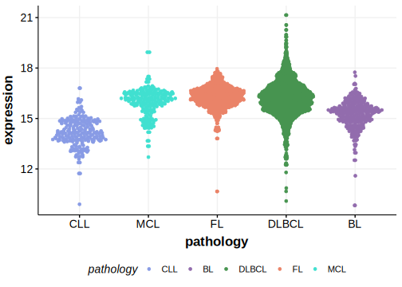

[[_TOC_]]

## Overview
TMSB4X is one of [a number of genes](https://github.com/morinlab/LLMPP/wiki/ashm) affected by aberrant somatic hypermutation in B-cell lymphomas, which complicates the interpretation of mutations at this locus.

## Relevance tier by entity

|Entity|Tier|Description                           |
|:------:|:----:|--------------------------------------|
||1|high-confidence PMBL/cHL/GZL gene|
| |1 | aSHM target and high-confidence DLBCL gene            [@zhangGeneticHeterogeneityDiffuse2013; @albuquerqueEnhancingKnowledgeDiscovery2017]|
|    |1| aSHM target and high-confidence FL gene               |

## Mutation incidence in large patient cohorts (GAMBL reanalysis)

[[include:DLBCL_TMSB4X.md]]
[[include:FL_TMSB4X.md]]

## Mutation pattern and selective pressure estimates

[[include:dnds_TMSB4X.md]]

## aSHM regions

|chr_name|hg19_start|hg19_end|region                                                                                      |regulatory_comment|
|:--------:|:----------:|:--------:|:--------------------------------------------------------------------------------------------:|:------------------:|
|chrX    |12993308  |12994511|[intron](https://genome.ucsc.edu/s/rdmorin/GAMBL%20hg19?position=chrX%3A12993308%2D12994511)|active_promoter   |

[[include:browser_TMSB4X.md]]

## Expression

<!-- ORIGIN: albuquerqueEnhancingKnowledgeDiscovery2017a -->
<!-- DLBCL: albuquerqueEnhancingKnowledgeDiscovery2017a -->

[[include:mermaid_TMSB4X.md]]

## References

