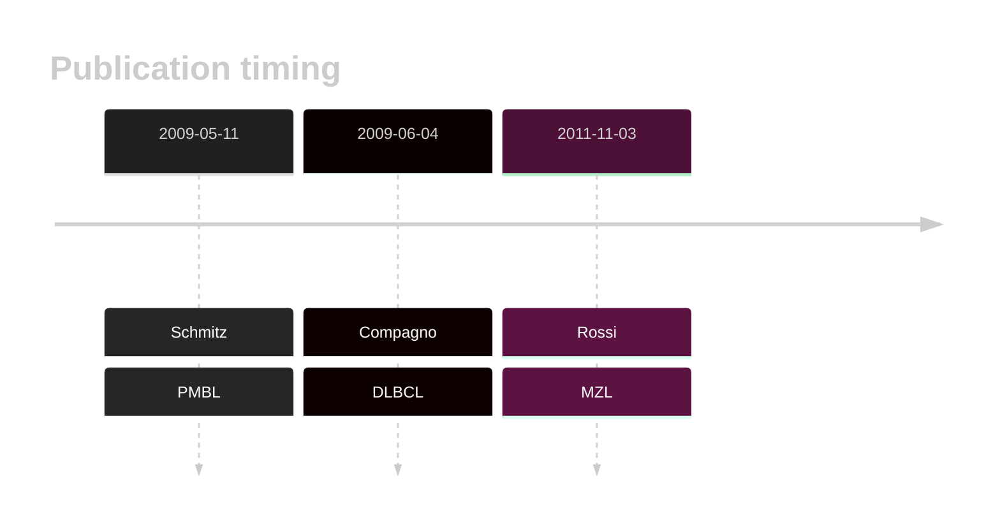
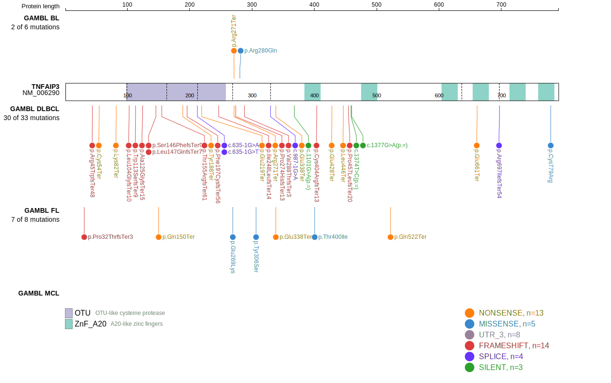
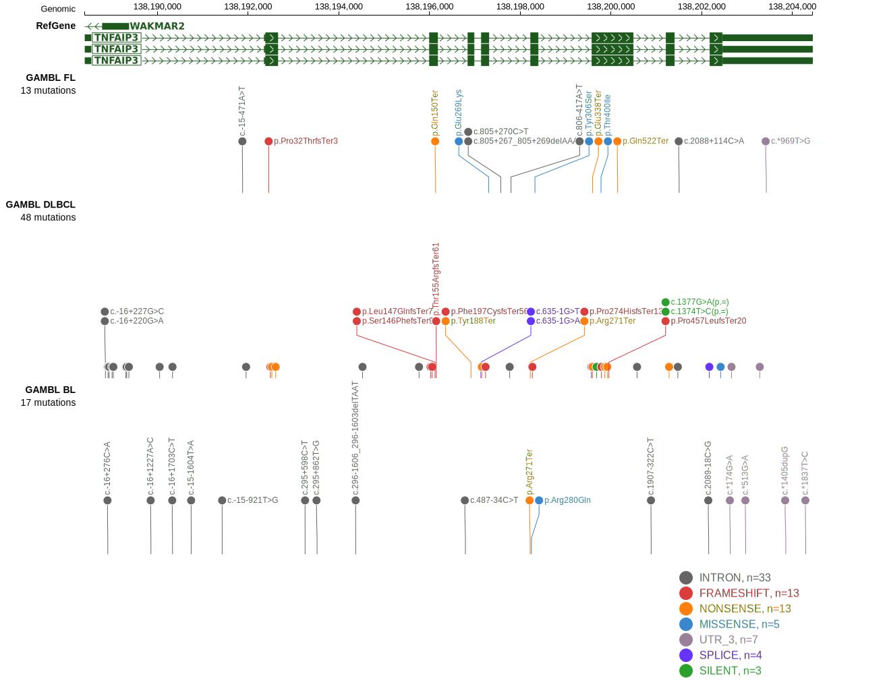
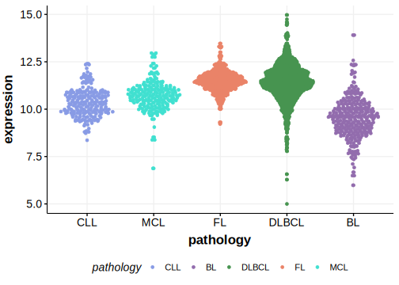

# TNFAIP3

## History

## Relevance tier by entity

|Entity|Tier|Description                           |
|:------:|:----:|--------------------------------------|
||1|high-confidence PMBL/cHL/GZL gene[@schmitzTNFAIP3A20Tumor2009a]|
||1|high-confidence MZL gene[@rossiAlterationBIRC3Multiple2011a]|
| |1   |high-confidence DLBCL gene            [@compagnoMutationsMultipleGenes2009a]|
|    |1   |high-confidence FL gene               |

## Mutation incidence in large patient cohorts (GAMBL reanalysis)

|Entity|source               |frequency (%)|
|:------:|:---------------------:|:-------------:|
|DLBCL |GAMBL genomes        | 6.69        |
|DLBCL |Schmitz cohort       |16.60        |
|DLBCL |Reddy cohort         | 8.11        |
|DLBCL |Chapuy cohort        |12.39        |
|FL    |GAMBL genomes        | 4.85        |

## Mutation pattern and selective pressure estimates

|Entity|aSHM|Significant selection|dN/dS (missense)|dN/dS (nonsense)|
|:------:|:----:|:---------------------:|:----------------:|:----------------:|
|BL    |No  |No                   |1.168           |16.846          |
|DLBCL |No  |Yes                  |1.550           |30.319          |
|FL    |No  |No                   |5.686           |75.953          |

## TNFAIP3 Hotspots

| Chromosome |Coordinate (hg19) | ref>alt | HGVSp | 
 | :---:| :---: | :--: | :---: |
| chr6 | 138197303 | G>A | E269K |
| chr6 | 138198218 | C>T | R271* |
| chr6 | 138198246 | G>A | R280Q |

View coding variants in ProteinPaint [hg19](https://morinlab.github.io/LLMPP/GAMBL/TNFAIP3_protein.html)  or [hg38](https://morinlab.github.io/LLMPP/GAMBL/TNFAIP3_protein_hg38.html)

View all variants in GenomePaint [hg19](https://morinlab.github.io/LLMPP/GAMBL/TNFAIP3.html)  or [hg38](https://morinlab.github.io/LLMPP/GAMBL/TNFAIP3_hg38.html)

## TNFAIP3 Expression

## References
<!-- ORIGIN: rossiAlterationBIRC3Multiple2011a -->
<!-- PMBL: schmitzTNFAIP3A20Tumor2009a -->
<!-- DLBCL: compagnoMutationsMultipleGenes2009a -->
<!-- MZL: rossiAlterationBIRC3Multiple2011a -->
