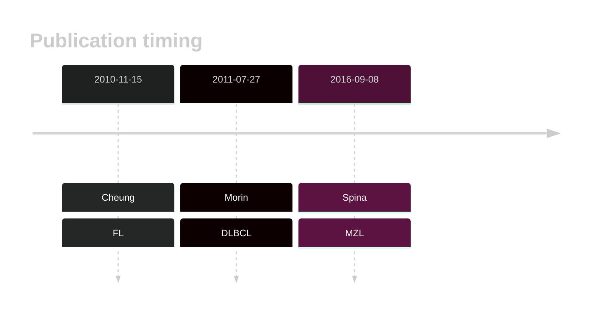
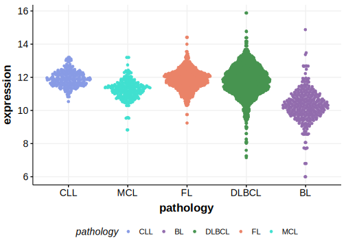

# TNFRSF14

## History

## Relevance tier by entity

|Entity|Tier|Description                           |
|:------:|:----:|--------------------------------------|
||1|high-confidence MZL gene[@spinaGeneticsNodalMarginal2016b] |
| |1   |high-confidence DLBCL gene[@morinFrequentMutationHistonemodifying2011]            |
|    |1   |high-confidence FL gene[@cheungAcquiredTNFRSF14Mutations2010a]               |

## Mutation incidence in large patient cohorts (GAMBL reanalysis)

|Entity|source               |frequency (%)|
|:------:|:---------------------:|:-------------:|
|DLBCL |GAMBL genomes        |14.34        |
|DLBCL |Schmitz cohort       |16.81        |
|DLBCL |Reddy cohort         | 9.71        |
|DLBCL |Chapuy cohort        |12.82        |
|FL    |GAMBL genomes        |40.42        |

## Mutation pattern and selective pressure estimates

|Entity|aSHM|Significant selection|dN/dS (missense)|dN/dS (nonsense)|
|:------:|:----:|:---------------------:|:----------------:|:----------------:|
|BL    |No  |No                   | 1.388          |  34.410        |
|DLBCL |No  |Yes                  |32.541          | 207.456        |
|FL    |No  |Yes                  |96.380          |1034.281        |

## TNFRSF14 Hotspots

| Chromosome |Coordinate (hg19) | ref>alt | HGVSp | 
 | :---:| :---: | :--: | :---: |
| chr1 | 2488104 | A>G | M1? |
| chr1 | 2488105 | T>C | M1? |
| chr1 | 2488105 | T>G | M1? |
| chr1 | 2488106 | G>A | M1? |
| chr1 | 2488107 | G>T | E2* |
| chr1 | 2488123 | G>A | W7* |
| chr1 | 2488124 | G>A | W7* |
| chr1 | 2488132 | C>A | P10H |
| chr1 | 2488138 | G>A | W12* |
| chr1 | 2488139 | G>A | W12* |
| chr1 | 2488152 | A>T | K17* |
| chr1 | 2488156 | C>A | T18N |

View coding variants in ProteinPaint [hg19](https://morinlab.github.io/LLMPP/GAMBL/TNFRSF14_protein.html)  or [hg38](https://morinlab.github.io/LLMPP/GAMBL/TNFRSF14_protein_hg38.html)

View all variants in GenomePaint [hg19](https://morinlab.github.io/LLMPP/GAMBL/TNFRSF14.html)  or [hg38](https://morinlab.github.io/LLMPP/GAMBL/TNFRSF14_hg38.html)

## TNFRSF14 Expression

<!-- ORIGIN: cheungAcquiredTNFRSF14Mutations2010a @cheungAcquiredTNFRSF14Mutations2010a -->
<!-- FL: cheungAcquiredTNFRSF14Mutations2010a -->
<!-- MZL: spinaGeneticsNodalMarginal2016b @spinaGeneticsNodalMarginal2016b -->
<!-- DLBCL: morinFrequentMutationHistonemodifying2011 -->

# References

