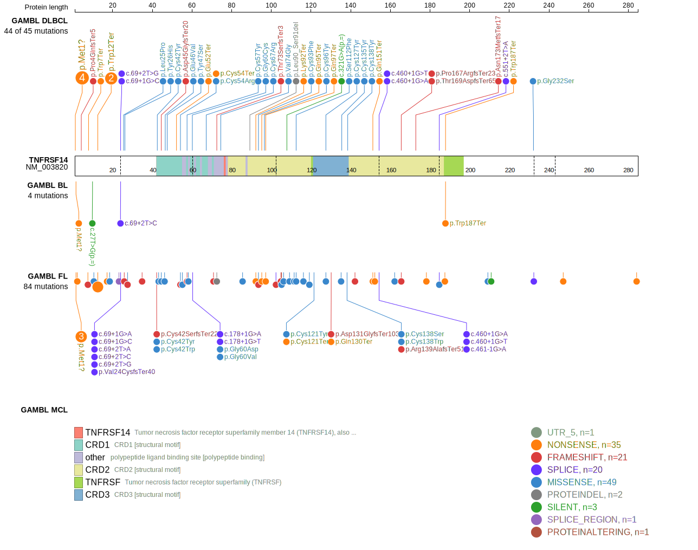
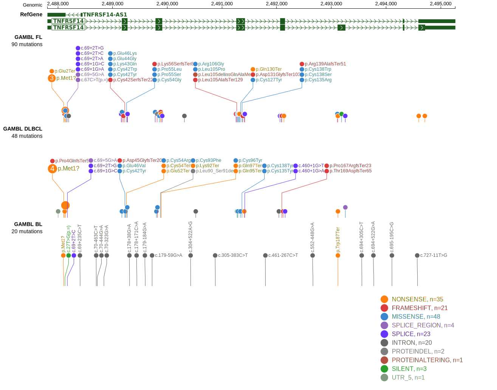

# TNFRSF14

## Relevance tier by entity

|Entity|Tier|Description                           |
|:------:|:----:|--------------------------------------|
|BL    |2   |relevance in BL not firmly established|
|DLBCL |1   |high-confidence DLBCL gene            |
|FL    |1   |high-confidence FL gene               |

## Mutation incidence in large patient cohorts (GAMBL reanalysis)

|Entity|source               |frequency (%)|
|:------:|:---------------------:|:-------------:|
|BL    |GAMBL genomes+capture| 1.39        |
|BL    |Thomas cohort        | 0.80        |
|BL    |Panea cohort         | 3.00        |
|DLBCL |GAMBL genomes        |14.34        |
|DLBCL |Schmitz cohort       |16.81        |
|DLBCL |Reddy cohort         | 9.71        |
|DLBCL |Chapuy cohort        |12.82        |
|FL    |GAMBL genomes        |40.42        |

## Mutation pattern and selective pressure estimates

|Entity|aSHM|Significant selection|dN/dS (missense)|dN/dS (nonsense)|
|:------:|:----:|:---------------------:|:----------------:|:----------------:|
|BL    |No  |No                   | 1.388          |  34.410        |
|DLBCL |No  |Yes                  |32.541          | 207.456        |
|FL    |No  |Yes                  |96.380          |1034.281        |

> [!NOTE]
> First described in DLBCL in 2010 by [Cheung KJ](https://pubmed.ncbi.nlm.nih.gov/20884631). First described in FL in 2011 by [Morin RD](https://pubmed.ncbi.nlm.nih.gov/21796119)

 ## TNFRSF14 Hotspots

| Chromosome |Coordinate (hg19) | ref>alt | HGVSp | 
 | :---:| :---: | :--: | :---: |
| chr1 | 2488104 | A>G | M1? |
| chr1 | 2488105 | T>C | M1? |
| chr1 | 2488105 | T>G | M1? |
| chr1 | 2488106 | G>A | M1? |
| chr1 | 2488107 | G>T | E2* |
| chr1 | 2488123 | G>A | W7* |
| chr1 | 2488124 | G>A | W7* |
| chr1 | 2488132 | C>A | P10H |
| chr1 | 2488138 | G>A | W12* |
| chr1 | 2488139 | G>A | W12* |
| chr1 | 2488152 | A>T | K17* |
| chr1 | 2488156 | C>A | T18N |

View coding variants in ProteinPaint [hg19](https://www.bcgsc.ca/downloads/morinlab/GAMBL/test/genes/TNFRSF14_protein.html)  or [hg38](https://www.bcgsc.ca/downloads/morinlab/GAMBL/test/genes/TNFRSF14_protein_hg38.html)

View all variants in GenomePaint [hg19](https://www.bcgsc.ca/downloads/morinlab/GAMBL/test/genes/TNFRSF14.html)  or [hg38](https://www.bcgsc.ca/downloads/morinlab/GAMBL/test/genes/TNFRSF14_hg38.html)

