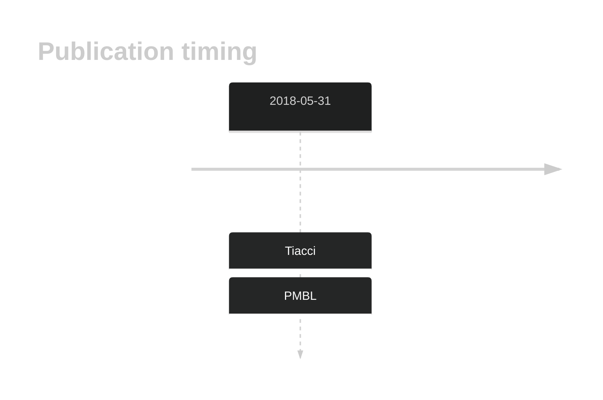

# TNIP1

## History

## Relevance tier by entity

|Entity|Tier|Description|
|:------:|:----:|--------------------------------------|
||2|relevance in PMBL/cHL/GZL not firmly established[@tiacciPervasiveMutationsJAKSTAT2018]|

## Mutation incidence in large patient cohorts (GAMBL reanalysis)

|Entity|source |frequency (%)|
|:------:|:----:|:----:|
|BL|GAMBL Exome |5.747 |
|BL|GAMBL Genome |0.772 |
|DLBCL|GAMBL Exome |1.995 |
|DLBCL|GAMBL Genome |1.692 |
|FL|GAMBL Exome |0.287 |

## References

