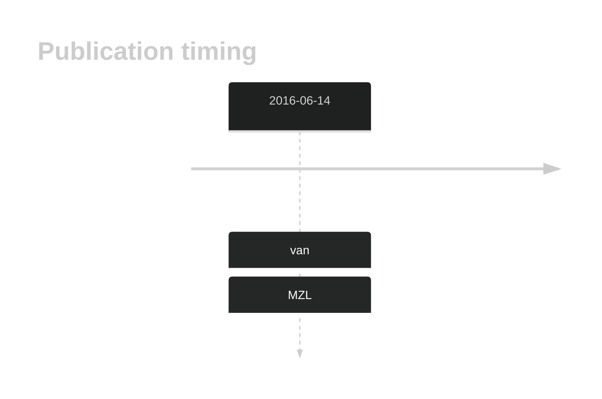

# TNIP2

## History

## Relevance tier by entity

|Entity|Tier|Description|
|:------:|:----:|--------------------------------------|
||2|relevance in MZL not firmly established[@vandenbrandRecurrentMutationsGenes2017]|

## Mutation incidence in large patient cohorts (GAMBL reanalysis)

|Entity|source |frequency (%)|
|:------:|:----:|:----:|
|BL|GAMBL Genome |0.386 |
|DLBCL|GAMBL Exome |0.593 |

## References

