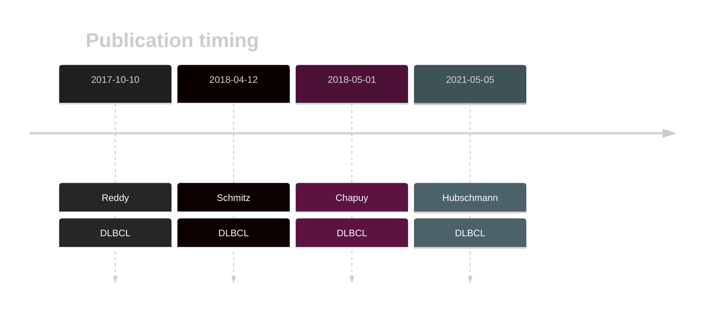

# TOX

## History

## Relevance tier by entity

|Entity|Tier|Description                           |
|:------:|:----:|--------------------------------------|
| |1   |high-confidence DLBCL gene            [@reddyGeneticFunctionalDrivers2017; @schmitzGeneticsPathogenesisDiffuse2018; @chapuyMolecularSubtypesDiffuse2018; @hubschmannMutationalMechanismsShaping2021]|

## Mutation incidence in large patient cohorts (GAMBL reanalysis)

[[include:DLBCL_TOX.md]]

## Mutation pattern and selective pressure estimates

|Entity|aSHM|Significant selection|dN/dS (missense)|dN/dS (nonsense)|
|:------:|:----:|:---------------------:|:----------------:|:----------------:|
|BL    |No  |No                   |1.503           |17.955          |
|DLBCL |No  |No                   |3.481           |12.292          |
|FL    |No  |No                   |1.975           |21.081          |

## TOX Hotspots

| Chromosome |Coordinate (hg19) | ref>alt | HGVSp | 
 | :---:| :---: | :--: | :---: |
| chr8 | 60031445 | C>G | K34N |
| chr8 | 60031445 | C>T | K34= |
| chr8 | 60031446 | T>G | K34T |

View coding variants in ProteinPaint [hg19](https://morinlab.github.io/LLMPP/GAMBL/TOX_protein.html)  or [hg38](https://morinlab.github.io/LLMPP/GAMBL/TOX_protein_hg38.html)

View all variants in GenomePaint [hg19](https://morinlab.github.io/LLMPP/GAMBL/TOX.html)  or [hg38](https://morinlab.github.io/LLMPP/GAMBL/TOX_hg38.html)

## TOX Expression

<!-- ORIGIN: reddyGeneticFunctionalDrivers2017 -->
<!-- DLBCL: reddyGeneticFunctionalDrivers2017 -->

## References
