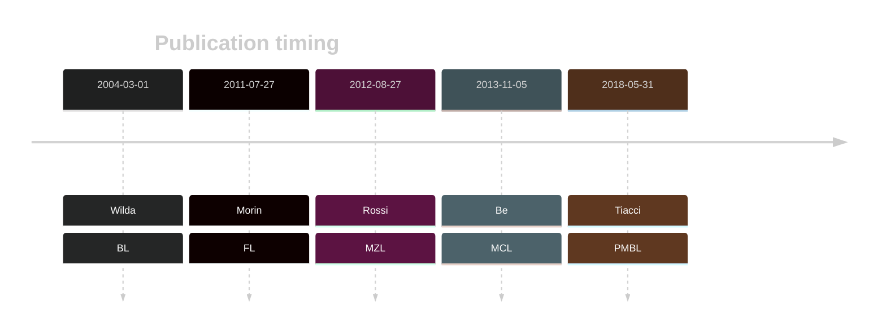
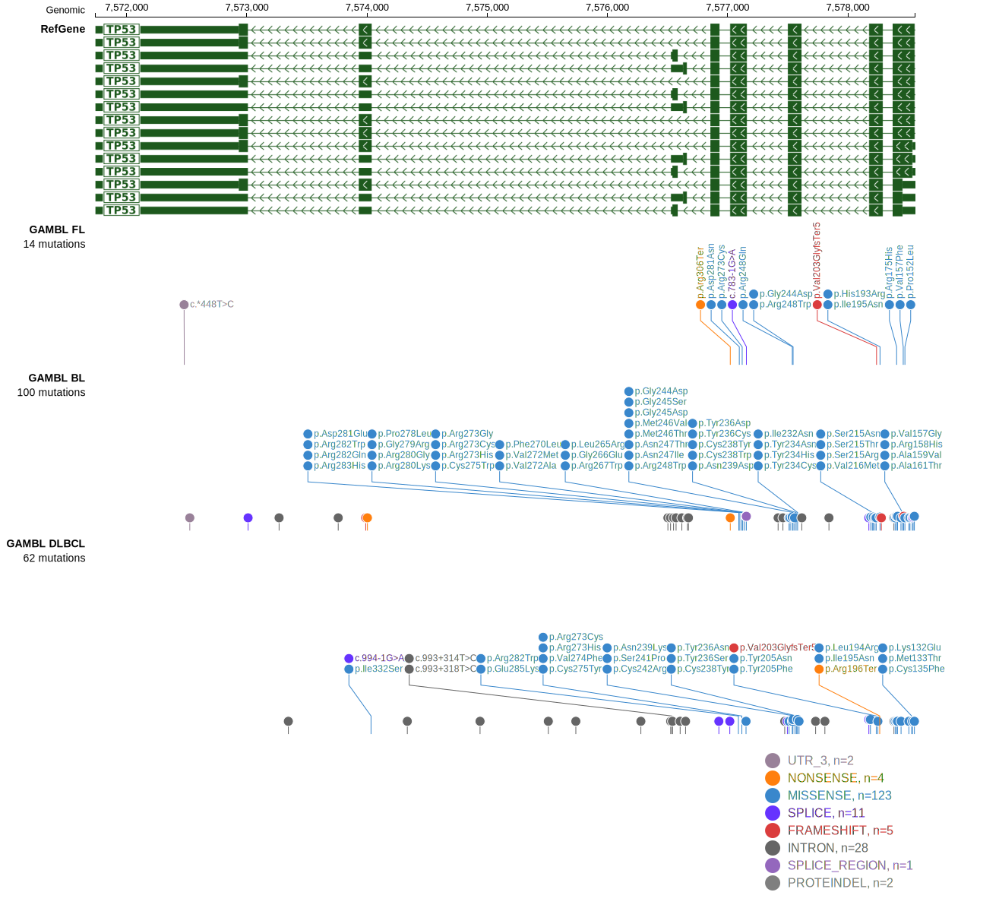

# TP53

## History

## Relevance tier by entity

|Entity|Tier|Description               |
|:------:|:----:|--------------------------|
||1|high-confidence MZL gene|
||1|high-confidence PMBL/cHL/GZL gene|
|    |1   |high-confidence BL gene   |
| |1   |high-confidence DLBCL gene|
|    |1   |high-confidence FL gene   |
|   |1   |high-confidence MCL gene  |

## Mutation incidence in large patient cohorts (GAMBL reanalysis)

|Entity|source               |frequency (%)|
|:------:|:---------------------:|:-------------:|
|BL    |GAMBL genomes+capture|45.50        |
|BL    |Thomas cohort        |41.90        |
|BL    |Panea cohort         |43.60        |
|DLBCL |GAMBL genomes        |27.53        |
|DLBCL |Schmitz cohort       |22.34        |
|DLBCL |Reddy cohort         |10.91        |
|DLBCL |Chapuy cohort        |21.37        |
|FL    |GAMBL genomes        | 6.93        |
|MCL   |GAMBL genomes        | 9.00        |

## Mutation pattern and selective pressure estimates

|Entity|aSHM|Significant selection|dN/dS (missense)|dN/dS (nonsense)|
|:------:|:----:|:---------------------:|:----------------:|:----------------:|
|BL    |No  |Yes                  | 83.783         | 58.309         |
|DLBCL |No  |Yes                  |127.531         |143.760         |
|FL    |No  |Yes                  | 63.211         |142.226         |

View coding variants in ProteinPaint [hg19](https://morinlab.github.io/LLMPP/GAMBL/TP53_protein.html)  or [hg38](https://morinlab.github.io/LLMPP/GAMBL/TP53_protein_hg38.html)

View all variants in GenomePaint [hg19](https://morinlab.github.io/LLMPP/GAMBL/TP53.html)  or [hg38](https://morinlab.github.io/LLMPP/GAMBL/TP53_hg38.html)

## TP53 Expression

<!-- ORIGIN: wildaInactivationARFMDM2p53Pathway2004 -->
<!-- BL: wildaInactivationARFMDM2p53Pathway2004 -->
<!-- FL: morinFrequentMutationHistonemodifying2011 -->
<!-- BL: wildaInactivationARFMDM2p53Pathway2004 -->
<!-- MCL: beaLandscapeSomaticMutations2013 -->
<!-- MZL: rossiCodingGenomeSplenic2012c -->
<!-- PMBL: tiacciPervasiveMutationsJAKSTAT2018b -->

## References
1.  Wilda M, Bruch J, Harder L, Rawer D, Reiter A, Borkhardt A, Woessmann W. Inactivation of the ARF-MDM-2-p53 pathway in sporadic Burkitt’s lymphoma in children. Leukemia. 2004 Mar;18(3):584–588. PMID: 14712292
2.  Morin RD, Mendez-Lago M, Mungall AJ, Goya R, Mungall KL, Corbett RD, Johnson NA, Severson TM, Chiu R, Field M, Jackman S, Krzywinski M, Scott DW, Trinh DL, Tamura-Wells J, Li S, Firme MR, Rogic S, Griffith M, Chan S, Yakovenko O, Meyer IM, Zhao EY, Smailus D, Moksa M, Chittaranjan S, Rimsza L, Brooks-Wilson A, Spinelli JJ, Ben-Neriah S, Meissner B, Woolcock B, Boyle M, McDonald H, Tam A, Zhao Y, Delaney A, Zeng T, Tse K, Butterfield Y, Birol I, Holt R, Schein J, Horsman DE, Moore R, Jones SJM, Connors JM, Hirst M, Gascoyne RD, Marra MA. Frequent mutation of histone-modifying genes in non-Hodgkin lymphoma. Nature. 2011 Jul 27;476(7360):298–303. PMCID: PMC3210554
3.  Rossi D, Trifonov V, Fangazio M, Bruscaggin A, Rasi S, Spina V, Monti S, Vaisitti T, Arruga F, Famà R, Ciardullo C, Greco M, Cresta S, Piranda D, Holmes A, Fabbri G, Messina M, Rinaldi A, Wang J, Agostinelli C, Piccaluga PP, Lucioni M, Tabbò F, Serra R, Franceschetti S, Deambrogi C, Daniele G, Gattei V, Marasca R, Facchetti F, Arcaini L, Inghirami G, Bertoni F, Pileri SA, Deaglio S, Foà R, Dalla-Favera R, Pasqualucci L, Rabadan R, Gaidano G. The coding genome of splenic marginal zone lymphoma: activation of NOTCH2 and other pathways regulating marginal zone development. J Exp Med. 2012 Aug 27;209(9):1537–1551. PMCID: PMC3428941
4.  Beà S, Valdés-Mas R, Navarro A, Salaverria I, Martín-Garcia D, Jares P, Giné E, Pinyol M, Royo C, Nadeu F, Conde L, Juan M, Clot G, Vizán P, Croce LD, Puente DA, López-Guerra M, Moros A, Roue G, Aymerich M, Villamor N, Colomo L, Martínez A, Valera A, Martín-Subero JI, Amador V, Hernández L, Rozman M, Enjuanes A, Forcada P, Muntañola A, Hartmann EM, Calasanz MJ, Rosenwald A, Ott G, Hernández-Rivas JM, Klapper W, Siebert R, Wiestner A, Wilson WH, Colomer D, López-Guillermo A, López-Otín C, Puente XS, Campo E. Landscape of somatic mutations and clonal evolution in mantle cell lymphoma. PNAS. 2013 Nov 5;110(45):18250–18255. PMID: 24145436
5.  Tiacci E, Ladewig E, Schiavoni G, Penson A, Fortini E, Pettirossi V, Wang Y, Rosseto A, Venanzi A, Vlasevska S, Pacini R, Piattoni S, Tabarrini A, Pucciarini A, Bigerna B, Santi A, Gianni AM, Viviani S, Cabras A, Ascani S, Crescenzi B, Mecucci C, Pasqualucci L, Rabadan R, Falini B. Pervasive mutations of JAK-STAT pathway genes in classical Hodgkin lymphoma. Blood. 2018 May 31;131(22):2454–2465. PMCID: PMC6634958
