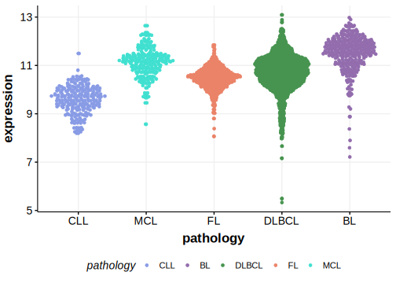

[[_TOC_]]

## Relevance tier by entity

|Entity|Tier|Description               |
|:------:|:----:|--------------------------|
||1|high-confidence MZL gene[@rossiCodingGenomeSplenic2012]|
||1|high-confidence PMBL/cHL/GZL gene[@tiacciPervasiveMutationsJAKSTAT2018]|
|    |1   |high-confidence BL gene   [@wildaInactivationARFMDM2p53Pathway2004]|
| |1   |high-confidence DLBCL gene[@lohrDiscoveryPrioritizationSomatic2012]|
|    |1   |high-confidence FL gene   [@morinFrequentMutationHistonemodifying2011]|
|   |1   |high-confidence MCL gene  [@beaLandscapeSomaticMutations2013]|

## Mutation incidence in large patient cohorts (GAMBL reanalysis)

[[include:DLBCL_TP53.md]]
[[include:FL_TP53.md]]
[[include:BL_TP53.md]]

## Mutation pattern and selective pressure estimates

[[include:dnds_TP53.md]]

[[include:browser_TP53.md]]

## Expression

<!-- ORIGIN: wildaInactivationARFMDM2p53Pathway2004 -->
<!-- BL: wildaInactivationARFMDM2p53Pathway2004 -->
<!-- FL: morinFrequentMutationHistonemodifying2011 -->
<!-- BL: wildaInactivationARFMDM2p53Pathway2004 -->
<!-- MCL: beaLandscapeSomaticMutations2013 -->
<!-- MZL: rossiCodingGenomeSplenic2012c -->
<!-- PMBL: tiacciPervasiveMutationsJAKSTAT2018b -->

[[include:mermaid_TP53.md]]

## References
